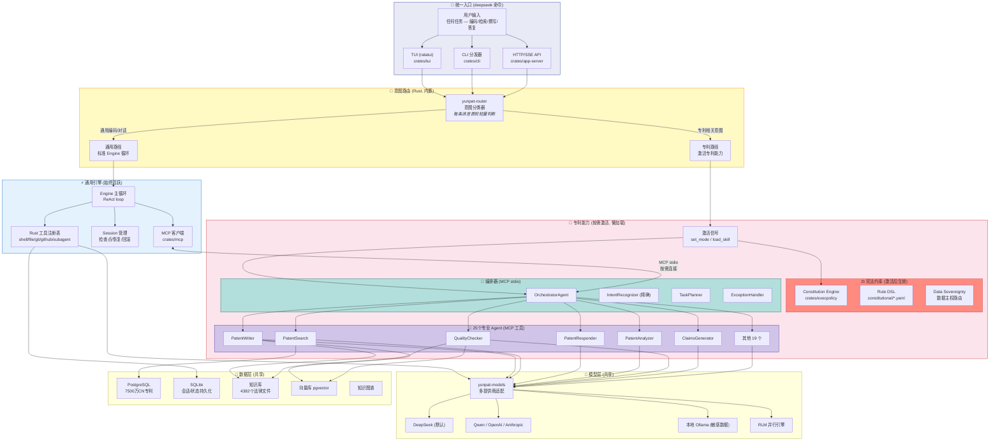
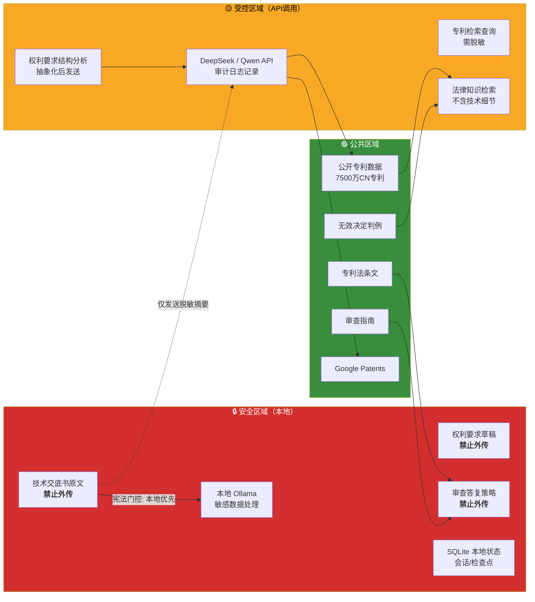
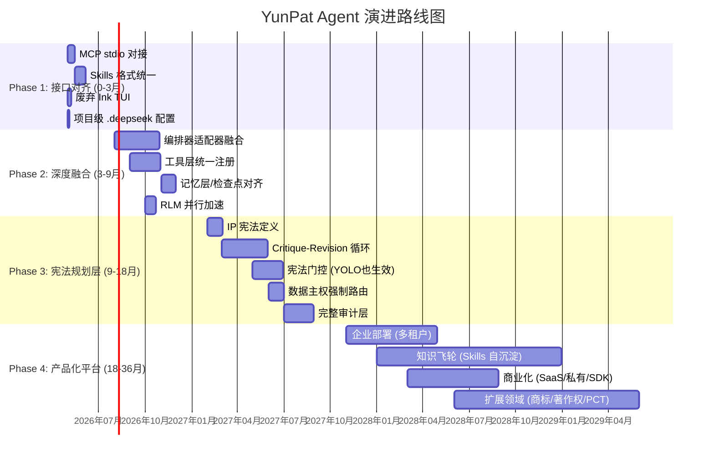
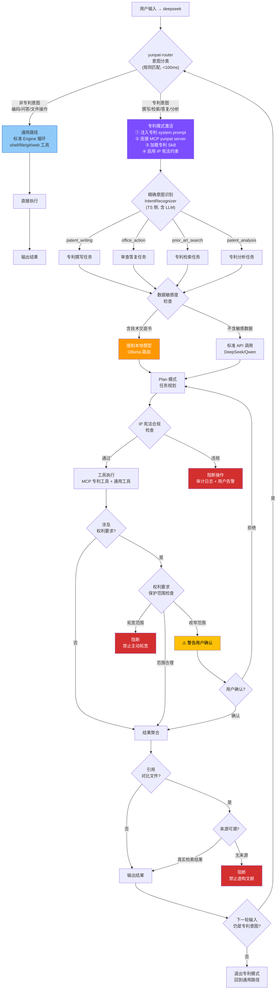
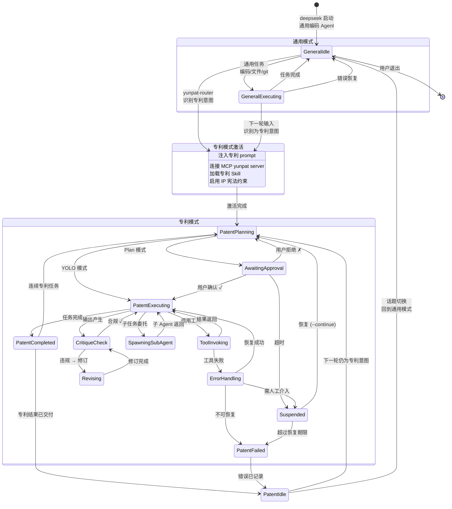
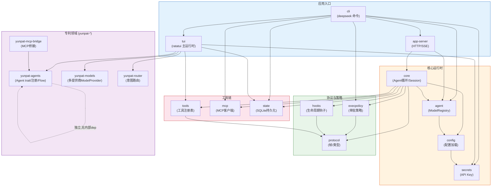
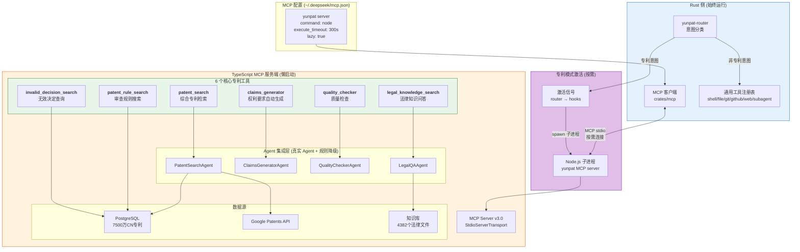
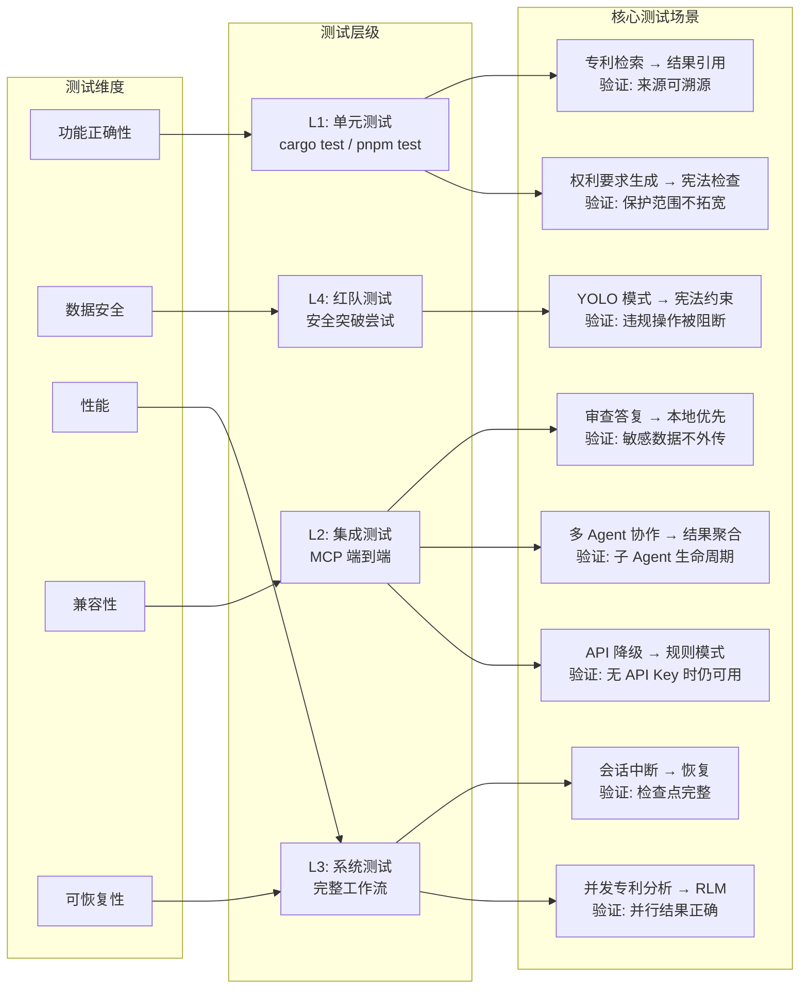

# YunPat Agent 架构全景图

> 本文档包含 8 张核心架构图，基于项目代码实际状态绘制。
> **维护规则**：当相关代码变更时，必须同步更新对应架构图。

---

## 图 1：系统分层架构图

**核心设计**：统一入口 `deepseek`，始终以通用编码 Agent 启动。当 `yunpat-router` 意图识别判定为专利相关时，按需激活专利能力（MCP 工具加载、宪法规则注入、编排器接入），形成「通用底座 + 专利模式热切换」架构。

**双路径运行模式**：

| 路径 | 触发条件 | 可用工具 | 宪法约束 | 模型 |
|------|---------|---------|---------|------|
| 通用路径 | 非专利意图（编码、问答、文件操作等） | shell, file, git, github, subagent, web 等 | 标准 execpolicy | DeepSeek (默认) |
| 专利路径 | `yunpat-router` 识别为专利意图 | 通用工具 **+** 6 个 MCP 专利工具 **+** 25 个 Agent | 标准 **+** IP 宪法 (CON-01~05) | 可路由至本地 Ollama |

**专利模式激活流程**（零用户感知）：
1. 用户输入 → `yunpat-router` 轻量分类（<100ms，不调用 LLM）
2. 若专利意图 → `hooks` 触发：注入专利 system prompt + 连接 MCP yunpat server + 加载专利 Skill
3. 后续 turn 自动在专利模式下运行，直到会话结束或用户切换话题
4. 同一会话内可自由在通用/专利模式间切换（由 router 每轮判定）

**层间通信协议**：
- 入口 → 路由层：Rust 函数调用（进程内）
- 路由层 → 通用引擎：标准 Engine 循环
- 路由层 → 专利激活：Hooks (JSONL) + `load_skill`
- 通用引擎 ↔ 专利编排：MCP stdio（按需连接）
- 专利编排 → 专利 Agent：TypeScript 函数调用（进程内）
- 工具 → 模型层：HTTP/SSE (OpenAI-compatible)

---

## 图 2：数据主权与合规边界图

**数据流合规规则**：

| 规则 ID | 数据类型 | 约束 | 实现位置 |
|---------|---------|------|---------|
| SOV-001 | 技术交底书原文 | 禁止出现在外部 API 请求中 | `execpolicy` 宪法门控 |
| SOV-002 | 权利要求草稿 | 仅允许抽象化后发送 | `hooks` post_response |
| SOV-003 | 审查答复策略 | 本地模型优先处理 | `config` 路由策略 |
| SOV-004 | 检索结果引用 | 必须附带原始来源 | `patent-tools` 输出格式 |
| SOV-005 | 竞争对手专利分析 | 禁止复制权利要求文字 | `hooks` pre_turn |
| SOV-006 | 所有操作 | 完整审计日志 | `hooks` jsonl/webhook |

---

## 图 3：长期演进路线图

**里程碑验证标准**：

| Phase | 完成标志 | 验证方式 |
|-------|---------|---------|
| P1 | `deepseek` 统一入口可用，专利意图识别后自动激活专利工具 | 输入专利问题 → MCP 工具自动加载 |
| P2 | Orchestrator 任务经 Engine 执行，session 可恢复 | 关闭终端后 `--continue` 恢复 |
| P3 | YOLO 模式下专利敏感数据不外传 | 红队测试：注入泄露指令被阻断 |
| P4 | 多租户隔离 + 企业独立部署 | 集成测试 + 安全审计 |

---

## 图 4：规则决策树

**核心设计**：`deepseek` 统一入口，每条消息经 `yunpat-router` 轻量分类。专利意图触发能力激活，通用意图走标准路径。同一会话内可自由切换。

**意图分类规则（`yunpat-router` 规则匹配，不调用 LLM）**：

| 匹配方式 | 专利关键词示例 | 非专利特征 |
|---------|-------------|-----------|
| 关键词匹配 | 专利、权利要求、审查意见、OA、新颖性、创造性、技术交底、检索报告、IPC | 函数、bug、文件、git、build |
| 上下文暗示 | 在 YunPat 项目目录下 + 法律/技术文档操作 | 在通用项目目录下 |
| 显式触发 | `/patent-*` slash 命令 | 无 |

**宪法条款编号**（仅在专利模式激活后生效）：
- CON-01：技术交底内容不得出现在 API 请求 prompt 中
- CON-02：权利要求措辞只能收紧，不能主动拓宽
- CON-03：引用对比文件必须附带原始检索结果
- CON-04：竞争对手专利分析禁止复制权利要求文字
- CON-05：所有专利操作必须记录审计日志

---

## 图 5：状态机图（Agent 生命周期）

**核心设计**：`deepseek` 始终以通用模式启动。`yunpat-router` 在每轮 turn 前做意图分类，识别到专利意图时激活专利模式，话题切换时自然回到通用模式。两个模式共享 Session 管理。

**双模式状态对比**：

| 属性 | 通用模式 | 专利模式 |
|------|---------|---------|
| 入口 | `deepseek` 启动即进入 | `yunpat-router` 意图识别后激活 |
| 可用工具 | shell, file, git, github, web, subagent... | 通用工具 **+** 6 MCP 专利工具 + 25 Agent |
| 宪法约束 | 标准 execpolicy | 标准 **+** IP 宪法 (CON-01~05) |
| 模型路由 | DeepSeek (默认) | 可路由至 Ollama (敏感数据) |
| Session 管理 | 共享 SQLite | 共享 SQLite (同一 session) |
| 模式切换 | 自动（每轮 router 判定） | 自动（每轮 router 判定） |
| 持久化 | schema_version, turn_index | plan_id, intent_type, tool_calls |

**Agent 状态表（SQLite 持久化，专利模式独有字段）**：

| 状态 | 触发条件 | 持久化 | 可恢复 |
|------|---------|--------|--------|
| GeneralIdle | deepseek 启动 / 通用任务结束 | session_id | — |
| PatentActivating | router 识别专利意图 | activated_skills, mcp_connected | — |
| PatentPlanning | 精确 Intent 匹配成功 | plan_id, intent_type | 是 |
| AwaitingApproval | Plan 模式 + 非自动审批 | approval_id | 是 |
| PatentExecuting | 审批通过 / YOLO | turn_index, tool_calls | 是 |
| CritiqueCheck | 专利输出产生后 | violation_list | 是 |
| Revising | IP 宪法审查未通过 | revision_count | 是 |
| Suspended | 超时 / 用户离开 / HITL | checkpoint_id | 是 (`--continue`) |
| SpawningSubAgent | 复杂专利任务分解 | sub_agent_id | 是 |
| PatentCompleted | 专利任务成功 | result_data | — |
| PatentFailed | 不可恢复错误 | error_detail | — |

---

## 图 6：模块依赖图（代码级）

**依赖分层规则**：

| 层级 | Crate | 允许依赖 |
|------|-------|---------|
| L0 叶节点 | protocol, config, secrets, state, tui-core | 无内部依赖 |
| L1 基础设施 | tools, mcp, hooks, execpolicy | 仅 L0 |
| L2 注册表 | agent | L0 |
| L3 核心运行时 | core | L0 + L1 + L2 |
| L4 应用入口 | cli, tui, app-server | L3 及以下 |
| 专利领域 | yunpat-agents, yunpat-models, yunpat-router | 独立（无内部 dep） |
| 桥接层 | yunpat-mcp-bridge | yunpat-agents |

---

## 图 7：MCP 工具注册表图

**核心设计**：MCP 服务端按需启动。通用模式下 yunpat MCP server 不运行（零开销），专利模式激活时才 spawn Node.js 子进程连接。

**懒启动策略**：

| 阶段 | MCP 服务端状态 | 资源占用 |
|------|--------------|---------|
| deepseek 启动 | 未启动 | 0 内存 |
| 通用模式运行 | 未启动 | 0 内存 |
| 专利意图首次识别 | spawn Node.js 子进程 | ~50MB |
| 专利任务执行中 | 已连接，工具可用 | ~50MB |
| 回到通用模式 | 保持连接（复用） | ~50MB |
| deepseek 退出 | 子进程自动终止 | 0 |

**工具参数速查**：

| 工具名 | 必填参数 | 可选参数 | 超时建议 |
|--------|---------|---------|---------|
| `patent_search` | query | mode, page, limit | 30s |
| `claims_generator` | technicalField, technicalProblem, keyFeatures, technicalSolution, beneficialEffects | — | 120s |
| `quality_checker` | claims, specification | — | 60s |
| `legal_knowledge_search` | question | domain, sources, topK | 30s |
| `invalid_decision_search` | query | domain, topK | 30s |
| `patent_rule_search` | query | articleType, topK | 30s |

**内部命名规则**：MCP 工具在 Rust 侧的调用名为 `mcp_yunpat_{tool_name}`，如 `mcp_yunpat_patent_search`。

---

## 图 8：验证测试矩阵图

**测试矩阵详细表**：

| 测试 ID | 场景 | 维度 | 层级 | Rust 测试 | TS 测试 | 红队 | 当前状态 |
|---------|------|------|------|-----------|---------|------|---------|
| T-001 | 专利检索返回真实引用 | 功能 | L1 | `cargo test -p yunpat-agents` | `pnpm test --filter mcp-server -- e2e` | — | ✅ 已有 |
| T-002 | 权利要求不主动拓宽 | 安全 | L1 | `cargo test -p execpolicy` | `pnpm test --filter mcp-server -- e2e` | — | ✅ 已实现 |
| T-003 | 技术交底不外传API | 安全 | L4 | — | `vitest run DataSovereigntyChecker` | 注入泄露指令 | ✅ 已实现 |
| T-004 | 会话恢复检查点完整 | 可恢复 | L3 | `cargo test -p state` | — | — | ✅ 已有 |
| T-005 | 子 Agent 生命周期 | 功能 | L2 | `cargo test -p core` | `pnpm test --filter orchestrator` | — | ⚠️ 部分（Phase 2 agent_spawn 后完善） |
| T-006 | YOLO 下宪法约束有效 | 安全 | L4 | — | — | 尝试绕过宪法 | ❌ Phase 3（Critique-Revision） |
| T-007 | MCP 工具降级模式 | 兼容 | L2 | `cargo test -p mcp` | `vitest run e2e` | — | ✅ 已验证 |
| T-008 | RLM 并行分析正确 | 性能 | L3 | `cargo test -p tui` | — | — | ⚠️ 部分（Phase 2 完善） |
| T-009 | Critique-Revision 循环 | 安全 | L2 | — | — | 构造违规输出 | ❌ Phase 3 |
| T-010 | 多租户数据隔离 | 安全 | L4 | — | — | 跨租户访问尝试 | ❌ Phase 4 |

---

## 维护指南

**当以下代码变更时，需同步更新对应架构图**：

| 变更范围 | 需更新图 | 检查方式 |
|---------|---------|---------|
| 新增/删除 Rust crate | 图1、图6 | `crates/Cargo.toml` workspace members |
| 新增/删除 TS package | 图1、图6 | `packages/pnpm-workspace.yaml` |
| 新增/删除 MCP 工具 | 图7 | `packages/mcp-server/src/tools/` |
| 修改数据流合规规则 | 图2、图4 | `constitutional/` 目录 |
| Agent 状态机变更 | 图5 | `crates/core/src/` turn_loop |
| 意图分类规则变更 | 图1路由层、图4、图5 | `crates/yunpat-router/src/` |
| 专利模式激活逻辑变更 | 图1专利激活层、图5 | `crates/hooks/` + `.deepseek/config.toml` |
| 新增测试类型 | 图8 | `tests/` 目录 + CI 配置 |
| 路线图里程碑调整 | 图3 | 项目规划会议决议 |
| 新增 Agent | 图1 业务层 | `packages/packages/agents/` |
