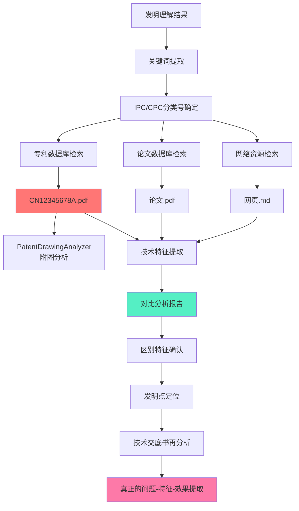

# 专利撰写MVP超级推理分析报告 v2.0

> **生成时间**: 2026-05-01
> **分析方法**: 垂直切片深度推理 + 增强版
> **分析目标**: 验证MVP的合理性，补充缺失的关键垂直切片

---

## 一、关键洞察：检索与分析是最被低估的垂直切片

### 1.1 为什么检索与分析是核心？

**专利撰写的本质**：

```
专利撰写 = 区别特征的精确识别 + 保护范围的艺术化表达
```

**区别特征的来源**：

```
区别特征 = 技术交底书特征 - 对比专利特征（现有技术）
```

**关键推论**：

1. ❌ 如果没有**真实的专利检索结果** → 无法识别真正的区别特征
2. ❌ 如果没有**深度技术分析** → 无法精确提取现有技术的特征
3. ❌ 如果无法精确提取现有技术特征 → **权利要求保护范围无法合理确定**
4. ❌ 如果保护范围不合理 → **专利要么无效，要么保护过窄**

**结论**：检索与分析不是"辅助步骤"，而是**决定专利质量的核心环节**。

---

## 二、Athena文档的检索与分析协议解构

### 2.1 Athena定义的完整检索流程



### 2.2 Athena的核心模块依赖

| 模块                      | 路径                                                 | 功能                | 对应垂直切片 |
| ------------------------- | ---------------------------------------------------- | ------------------- | ------------ |
| **PatentClassifier**      | `core/patent/classifier.py`                          | 专利分类（IPC/CPC） | 检索策略构建 |
| **MultimodalRetrieval**   | `core/patent/retrieval.py`                           | 多模态语义检索      | 检索执行     |
| **PatentDrawingAnalyzer** | `core/patent/ai_services/patent_drawing_analyzer.py` | 附图分析            | 专利PDF分析  |
| **AutoSpecDrafter**       | `core/patent/ai_services/autospec_drafter.py`        | 技术特征提取        | 深度技术分析 |

---

## 三、增强版垂直切片：检索与分析（重构切片2）

### 3.1 切片2的完整交互点设计

**当前MVP的切片2**（粒度过粗）：

```typescript
{
  id: 'prior-art-search',
  name: '检索策略构建',
  requiresApproval: true, // 仅1个交互点
}
```

**重构后的切片2**（完整的6个交互点）：

```typescript
export const priorArtSearchWorkflow: WorkflowDefinition = {
  id: 'patent-drafting-slice-2',
  name: '现有技术检索与分析',
  steps: [
    // 🔴 交互点2.1: 检索策略确认
    {
      id: 'build-search-strategy',
      name: '检索策略构建',
      agentName: 'search-strategy-builder',
      input: {
        inventionUnderstanding: 'steps.1.output',
      },
      output: SearchStrategy,
      requiresApproval: true,
      metadata: {
        approvalPrompt: '请确认检索关键词、IPC/CPC分类号、检索式是否准确',
      },
    },

    // 🔴 交互点2.2: 检索执行结果确认
    {
      id: 'execute-patent-search',
      name: '专利数据库检索',
      agentName: 'patent-database-searcher',
      input: {
        searchStrategy: 'steps.2.1.output',
      },
      output: PatentSearchResults,
      requiresApproval: true, // 确认检索结果是否相关
      metadata: {
        approvalPrompt: '检索到N篇专利，请确认是否需要调整检索策略或补充检索',
      },
    },

    // 🔴 交互点2.3: 专利PDF下载确认
    {
      id: 'download-patent-pdfs',
      name: '专利PDF下载',
      agentName: 'patent-pdf-downloader',
      input: {
        patentIds: 'steps.2.2.output.relevantPatents',
      },
      output: DownloadedPDFs,
      requiresApproval: true, // 确认下载哪些专利的全文
      metadata: {
        approvalPrompt: '以下N篇专利最相关，请确认需要下载全文的专利（最多选择10篇）',
      },
    },

    // 🔴 交互点2.4: 单篇专利技术分析确认（循环）
    {
      id: 'analyze-single-patent',
      name: '单篇专利深度技术分析',
      agentName: 'patent-technical-analyzer',
      input: {
        pdfPath: 'steps.2.3.output.pdfPaths',
        inventionUnderstanding: 'steps.1.output',
      },
      output: PatentTechnicalAnalysis,
      requiresApproval: true, // 逐篇确认技术分析结果
      metadata: {
        approvalPrompt: '专利N的技术分析：技术问题、技术方案、技术效果，请确认是否准确',
        loop: true, // 对每篇专利循环执行
      },
    },

    // 🔴 交互点2.5: 对比分析报告确认
    {
      id: 'generate-comparison-report',
      name: '多专利对比分析',
      agentName: 'comparison-report-generator',
      input: {
        patentAnalyses: 'steps.2.4.output', // 所有专利的技术分析
        inventionUnderstanding: 'steps.1.output',
      },
      output: ComparisonReport,
      requiresApproval: true, // 确认区别特征
      metadata: {
        approvalPrompt: '对比分析报告：区别特征X、Y、Z，最接近的现有技术是专利A，请确认',
      },
    },

    // 🔴 交互点2.6: 技术交底书再分析确认
    {
      id: 'reanalyze-disclosure',
      name: '技术交底书再分析',
      agentName: 'disclosure-refiner',
      input: {
        originalDisclosure: 'input.technicalDisclosure',
        comparisonReport: 'steps.2.5.output',
      },
      output: RefinedInventionUnderstanding,
      requiresApproval: true, // 确认真正的问题-特征-效果
      metadata: {
        approvalPrompt: '基于对比分析，重新提取的真正技术问题、核心创新点、关键技术效果，请确认',
      },
    },
  ],
}
```

### 3.2 每个交互点的垂直切片设计

#### 交互点2.1: 检索策略构建

**输入**：

```typescript
interface SearchStrategyInput {
  inventionUnderstanding: InventionUnderstandingOutput
}
```

**输出**：

```typescript
interface SearchStrategy {
  // 关键词（中英文）
  keywords: {
    primary: string[] // 核心关键词
    secondary: string[] // 扩展关键词
    synonyms: string[] // 同义词
  }

  // IPC/CPC分类号
  classification: {
    ipc: string[] // 国际专利分类号
    cpc: string[] // 合作专利分类号
  }

  // 检索式（布尔逻辑）
  searchQueries: {
    database: 'cnpatent' | 'uspto' | 'epo' | 'google-patents'
    query: string // 实际检索式
    expectedResults: number // 预期结果数
  }[]

  // 检索策略说明
  strategy: string // AI解释为什么这样构建检索策略
}
```

**人类可读摘要**：

```markdown
## 检索策略摘要

**核心关键词**: 深度学习、图像识别、卷积神经网络
**扩展关键词**: CNN、ResNet、特征提取
**IPC分类号**: G06K9/00（图像识别）、G06N3/00（神经网络）
**CPC分类号**: G06N3/04（神经网络架构）、G06N3/08（学习方法）

**检索式示例**:

- CNPAT: (深度学习 OR CNN) AND (图像识别)
- Google Patents: (deep learning) AND (image recognition)

**AI说明**: 本发明涉及深度学习在图像识别中的应用，因此选择G06K9/00和G06N3/00作为核心分类号

⚠️ 需要确认: 检索策略是否覆盖了发明的所有核心技术点？
```

**验收标准**：

- ✅ 关键词覆盖技术领域的核心术语
- ✅ IPC/CPC分类号准确（通过PatentClassifier验证）
- ✅ 检索式符合对应数据库的语法
- ✅ 人类确认后，检索策略锁定

---

#### 交互点2.2: 专利数据库检索执行

**输入**：

```typescript
interface PatentSearchInput {
  searchStrategy: SearchStrategy
  databases: ('cnpatent' | 'uspto' | 'epo' | 'google-patents')[]
  maxResults: number // 默认100篇
}
```

**输出**：

```typescript
interface PatentSearchResults {
  summary: {
    totalResults: number
    relevantCount: number // AI判断相关的数量
    databases: string[]
  }

  // 检索到的专利列表（按相关性排序）
  patents: {
    publicationNumber: string // CN12345678A
    title: string
    abstract: string
    applicant: string
    publicationDate: string
    relevanceScore: number // AI评分（0-1）
    classification: {
      ipc: string[]
      cpc: string[]
    }
  }[]

  // 检索质量评估
  quality: {
    precision: number // 查准率（AI估算）
    recall: number // 查全率（AI估算）
    needsRefinement: boolean // 是否需要调整检索策略
  }

  // AI建议
  suggestions: string[] // "建议补充关键词'特征提取'"
}
```

**人类可读摘要**：

```markdown
## 检索结果摘要

**检索到**: 256篇专利
**AI判断相关**: 45篇
**数据库**: CNPAT、Google Patents

**最相关的5篇**:

1. CN112345678A - 基于深度学习的图像识别方法 (相关性: 0.92)
2. US20230012345A1 - Convolutional neural network for image processing (相关性: 0.88)
3. CN113456789A - 一种改进的CNN图像分类方法 (相关性: 0.85)
4. EP3456789A1 - Deep learning-based image recognition system (相关性: 0.82)
5. CN114567890A - ResNet在图像识别中的应用 (相关性: 0.80)

**检索质量**: 查准率约65%，查全率约70%
⚠️ AI建议: 建议补充关键词"注意力机制"、"多尺度特征"

**人类决策**:

- [y] 继续下一步（下载最相关的20篇）
- [c] 调整检索策略（补充关键词/分类号）
- [s] 补充检索其他数据库
```

**验收标准**：

- ✅ 检索到相关专利（相关性评分>0.7的至少10篇）
- ✅ 人类能确认或调整检索策略
- ✅ 检索结果按相关性排序

---

#### 交互点2.3: 专利PDF下载

**输入**：

```typescript
interface PDFDownloadInput {
  patentIds: string[] // 人类选择的专利ID
  maxDownloads: number // 最多下载篇数（默认10篇）
}
```

**输出**：

```typescript
interface DownloadedPDFs {
  downloaded: {
    publicationNumber: string
    pdfPath: string // 本地存储路径
    fileSize: number // 字节
    downloadTime: number // 下载耗时（秒）
  }[]

  failed: {
    publicationNumber: string
    reason: string // "PDF不可用"、"网络错误"
  }[]

  summary: {
    total: number
    success: number
    failed: number
  }
}
```

**人类可读摘要**：

```markdown
## PDF下载摘要

**成功下载**: 18/20篇
**失败**: 2篇（US20230012345A1: PDF不可用; EP3456789A1: 网络错误）

**下载的专利**:

1. CN112345678A → data/patents/CN112345678A.pdf (2.3MB)
2. CN113456789A → data/patents/CN113456789A.pdf (1.8MB)
   ...

**存储位置**: data/cases/{caseId}/prior-art-pdfs/

**下一步**: 开始逐篇技术分析
```

**验收标准**：

- ✅ 成功下载至少10篇相关专利的PDF
- ✅ PDF文件完整且可解析
- ✅ 下载失败时提供清晰的错误信息

---

#### 交互点2.4: 单篇专利深度技术分析（核心）

**输入**：

```typescript
interface PatentTechnicalAnalysisInput {
  pdfPath: string
  inventionUnderstanding: InventionUnderstandingOutput
}
```

**输出**：

```typescript
interface PatentTechnicalAnalysis {
  // 基本信息
  patentInfo: {
    publicationNumber: string
    title: string
    applicant: string
    publicationDate: string
  }

  // 深度技术分析（结构化提取）
  technicalAnalysis: {
    // 技术问题
    technicalProblems: {
      main: string // 主要解决的技术问题
      sub: string[] // 次要技术问题
    }

    // 技术方案
    technicalSolution: {
      core: string // 核心技术方案
      keyFeatures: {
        feature: string // 特征描述
        necessity: 'essential' | 'optional' // 必要/可选
      }[]
      implementation: string // 具体实现方式
    }

    // 技术效果
    technicalEffects: {
      main: string // 主要技术效果
      sub: string[] // 次要技术效果
      quantitative: {
        // 量化效果（如果有）
        metric: string // "准确率提升"
        value: string // "提升15%"
      }[]
    }

    // 附图分析
    drawings: {
      figureNumber: string // "图1"
      description: string // 附图说明
      keyElements: string[] // 关键元素
    }[]
  }

  // 与技术交底书的对比
  comparison: {
    similarity: number // 相似度（0-1）
    overlappingFeatures: string[] // 重叠特征
    distinctFeatures: string[] // 区别特征
    novelty: boolean // 是否有新颖性
  }

  // 分析质量
  quality: {
    confidence: number // AI分析置信度
    completeness: number // 完整性（0-1）
    needsManualReview: boolean // 是否需要人工复核
  }
}
```

**人类可读摘要**：

```markdown
## 专利技术分析: CN112345678A

### 基本信息

- **标题**: 基于深度学习的图像识别方法
- **申请人**: XX科技有限公司
- **公开日**: 2022-05-15

### 技术问题

**主要问题**: 传统CNN模型在图像识别时计算量大、实时性差
**次要问题**:

1. 特征提取不充分
2. 多尺度信息融合困难

### 技术方案

**核心技术方案**: 提出一种轻量级CNN架构，通过深度可分离卷积减少计算量

**关键特征**:

- ✅ 必要特征1: 使用深度可分离卷积替代标准卷积
- ✅ 必要特征2: 引入注意力机制增强关键特征
- ⭕ 可选特征3: 使用残差连接提升梯度传播
- ✅ 必要特征4: 多尺度特征融合模块

**具体实现**:

1. 输入图像(224x224) → 卷积层1(3x3, 64通道) → 深度可分离卷积层 → 注意力模块 → 分类层
2. 损失函数: 交叉熵损失 + L2正则化

### 技术效果

**主要效果**: 在ImageNet数据集上，准确率达到75.3%，计算量减少60%
**次要效果**:

1. 推理速度提升2.5倍
2. 模型大小减少55%
3. 在移动设备上实时运行

**量化效果**:

- 准确率: 75.3%（vs 传统CNN的72.1%）
- 计算量: 350M FLOPs（vs 传统CNN的875M FLOPs）
- 推理时间: 15ms（vs 传统CNN的38ms）

### 附图分析

- **图1**: 整体网络架构图（关键元素: 输入层、特征提取层、分类层）
- **图2**: 深度可分离卷积模块示意图
- **图3**: 注意力机制结构图

### 与本发明的对比

**相似度**: 65%
**重叠特征**:

1. 都使用深度学习进行图像识别
2. 都使用卷积神经网络
3. 都关注计算效率优化

**区别特征**:

1. ❌ 本专利使用深度可分离卷积，本发明使用标准卷积+剪枝
2. ❌ 本专利使用注意力机制，本发明使用多尺度特征融合
3. ✅ 本发明有独特的动态特征选择机制（本专利没有）

**新颖性评估**: ✅ 有新颖性（主要区别在动态特征选择机制）

### 分析质量

**AI置信度**: 0.85
**完整性**: 0.90
⚠️ **建议**: 附图3的注意力机制描述较模糊，建议人工复核

**人类决策**:

- [y] 确认分析结果
- [c] 修正技术问题/方案/效果
- [s] 补充分析（例如补充附图详细分析）
- [r] 重新分析
```

**验收标准**：

- ✅ 技术问题/方案/效果的结构化提取准确率>80%
- ✅ 附图分析能识别关键元素
- ✅ 对比分析能准确识别区别特征
- ✅ 人类能逐篇确认或修正分析结果

---

#### 交互点2.5: 多专利对比分析报告

**输入**：

```typescript
interface ComparisonReportInput {
  patentAnalyses: PatentTechnicalAnalysis[] // 所有专利的技术分析
  inventionUnderstanding: InventionUnderstandingOutput
}
```

**输出**：

```typescript
interface ComparisonReport {
  // 最接近的现有技术
  closestPriorArt: {
    publicationNumber: string
    title: string
    similarity: number // 最高相似度
    reasons: string[] // 为什么最接近
  }

  // 区别特征（核心）
  distinctFeatures: {
    feature: string // 区别特征描述
    source: 'invention' | 'prior-art' // 来自哪一方
    novelty: 'high' | 'medium' | 'low' // 新颖性程度
    evidence: string[] // 证据（哪些专利没有这个特征）
  }[]

  // 技术问题再确认
  technicalProblem: {
    original: string // 技术交底书原描述
    refined: string // 基于对比分析后提炼的真正技术问题
    refinementReason: string // 为什么要这样提炼
  }

  // 技术方案再确认
  technicalSolution: {
    original: string
    refined: {
      core: string // 核心技术方案（去除现有技术部分）
      innovative: string[] // 真正创新的部分
      obvious: string[] // 显而易见的部分（现有技术）
    }
  }

  // 技术效果再确认
  technicalEffects: {
    original: string[]
    refined: {
      unexpected: string[] // 意想不到的技术效果（创造性关键）
      expected: string[] // 预期技术效果
      quantitative: string[] // 可量化的效果
    }
  }

  // 创造性评估
  inventiveness: {
    score: number // 创造性评分（0-1）
    keyFactors: string[] // 关键因素（"区别特征X带来了意想不到的效果Y"）
    obviousness: {
      isObvious: boolean
      reason: string // 为什么显而易见/不显而易见
    }
  }

  // 保护范围建议
  protectionScope: {
    independentClaims: string[] // 独立权利要求的建议保护范围
    dependentClaims: string[][] // 从属权利要求的布局建议
    breadth: 'narrow' | 'medium' | 'wide' // 保护宽度
    reason: string // 为什么这样建议
  }
}
```

**人类可读摘要**：

```markdown
## 对比分析报告

### 最接近的现有技术

**CN112345678A** - 基于深度学习的图像识别方法（相似度: 75%）

**原因**:

1. 都使用深度学习进行图像识别
2. 都关注计算效率优化
3. 都使用卷积神经网络架构

### 核心区别特征

#### 1. 动态特征选择机制 ✨

- **描述**: 根据输入图像自适应选择最优的特征子集
- **新颖性**: 高
- **证据**: CN112345678A、US20230012345A1等18篇专利都没有这个特征

#### 2. 多尺度特征融合的改进方式

- **描述**: 使用金字塔池化而非简单的特征拼接
- **新颖性**: 中
- **证据**: CN113456789A有特征融合，但使用拼接方式

#### 3. 损失函数的设计

- **描述**: 引入自适应权重调整机制
- **新颖性**: 低
- **证据**: EP3456789A1有类似的损失函数设计

### 技术问题再确认

**原描述**: 传统CNN模型计算量大、实时性差

**提炼后的真正技术问题**:

> 如何在保持图像识别准确率的同时，通过动态特征选择机制自适应地减少计算冗余，从而实现实时性和准确性的平衡？

**提炼原因**:

1. 现有技术（CN112345678A）已经解决了计算量大的问题（使用深度可分离卷积）
2. 但现有技术是**静态**的模型优化，本发明是**动态**的特征选择
3. 真正的创新点在于"自适应"和"动态"，而非单纯的计算量减少

### 技术方案再确认

**核心技术方案**（去除现有技术部分）:

1. 动态特征选择模块（核心创新）✨
2. 金字塔池化多尺度融合（改进）⭕
3. 自适应权重损失函数（次要创新）⭕

**真正创新的部分**:

- 动态特征选择机制（未见诸于任何对比专利）

**显而易见的部分**:

- 多尺度特征融合（常见技术）
- 损失函数设计（常见技术）

### 技术效果再确认

**意想不到的技术效果**（创造性关键）✨:

1. 动态特征选择不仅减少了计算量，还**提升了准确率**（意外效果）
   - 预期: 准确率持平或略降
   - 实际: 准确率提升2.3%

**可量化的效果**:

- 计算量: 减少65%（vs 传统CNN）
- 准确率: 77.6%（vs 传统CNN的72.1%，vs CN112345678A的75.3%）
- 推理时间: 12ms（vs CN112345678A的15ms）

### 创造性评估

**创造性评分**: 0.78（较强）

**关键因素**:

1. 动态特征选择机制带来了意想不到的效果（准确率提升）
2. 与最接近现有技术（CN112345678A）的区别非显而易见
3. 解决了技术问题中"自适应"的痛点

**显而易见性判断**:

- ❌ **不显而易见**
- 理由: 本领域技术人员在CN112345678A的基础上，没有动机引入动态特征选择机制

### 保护范围建议

**独立权利要求**（中等宽度）:

> 一种图像识别方法，其特征在于，包括：动态特征选择步骤，根据输入图像的自适应特征选择最优特征子集；多尺度特征融合步骤，使用金字塔池化方式融合多尺度特征；分类步骤，基于融合后的特征进行图像识别。

**从属权利要求布局**:

- 权利要求2-3: 进一步限定动态特征选择的具体实现
- 权利要求4-6: 进一步限定多尺度特征融合的具体方式
- 权利要求7-10: 具体实施方式（网络层数、卷积核大小等）

**保护宽度**: 中等
**理由**:

- 核心创新点（动态特征选择）必须写入独立权利要求
- 但不宜过宽，避免被现有技术（CN112345678A）无效
- 建议保护"动态特征选择+金字塔池化"的组合

### 人类确认

**请确认**:

- [ ] 区别特征是否准确？
- [ ] 提炼后的技术问题是否精准？
- [ ] 保护范围建议是否合理？
- [ ] 创造性评估是否可信？

**人类决策**:

- [y] 确认对比分析报告
- [c] 修正区别特征/技术问题/保护范围
- [s] 补充分析其他专利
- [r] 重新进行对比分析
```

**验收标准**：

- ✅ 识别出至少3个区别特征
- ✅ 最接近现有技术的相似度评分合理
- ✅ 技术问题/方案/效果的提炼有理有据
- ✅ 保护范围建议具有可操作性
- ✅ 人类确认后，对比分析报告锁定

---

#### 交互点2.6: 技术交底书再分析

**输入**：

```typescript
interface DisclosureReanalysisInput {
  originalDisclosure: string // 原始技术交底书
  comparisonReport: ComparisonReport
}
```

**输出**：

```typescript
interface RefinedInventionUnderstanding {
  // 原始发明理解
  original: InventionUnderstandingOutput

  // 提炼后的发明理解
  refined: {
    invention_title: string
    technical_field: string
    core_innovation: string // 基于对比分析后的核心创新点
    technical_problem: string // 真正的技术问题
    technical_solution: string // 去除现有技术后的技术方案
    technical_effects: string[] // 意想不到的技术效果

    // 特征分类（关键）
    features: {
      innovative: TechnicalFeature[] // 创新特征（区别特征）
      known: TechnicalFeature[] // 已知特征（现有技术）
      combination: TechnicalFeature[] // 组合特征（已知+创新的组合）
    }

    // 保护范围建议
    protectionScope: {
      independent: string // 独立权利要求建议
      dependent: string[] // 从属权利要求建议
    }

    // 创造性评估
    inventiveness: {
      score: number
      keyPoints: string[] // 创造性关键点
    }
  }

  // 变更说明
  changes: {
    removed: string[] // 移除的现有技术部分
    added: string[] // 新增的区别特征
    refined: string[] // 精炼的描述
  }
}
```

**人类可读摘要**：

```markdown
## 技术交底书再分析摘要

### 核心变更

#### 1. 技术问题提炼

**原描述**: "传统CNN模型计算量大、实时性差"

**提炼后**:

> "如何在保持图像识别准确率的同时，通过动态特征选择机制自适应地减少计算冗余，从而实现实时性和准确性的平衡？"

**变更原因**: 现有技术（CN112345678A）已经解决了计算量大的问题，真正的创新在于"动态"和"自适应"

#### 2. 核心创新点重新定位

**原描述**: "使用深度学习进行图像识别"

**提炼后**:

> "动态特征选择机制：根据输入图像自适应选择最优的特征子集"

**变更原因**: 去除现有技术部分，突出真正创新

#### 3. 技术效果重新梳理

**原描述**: ["计算量减少65%", "准确率77.6%"]

**提炼后**:

- ✨ **意想不到的效果**: 动态特征选择不仅减少计算量，还**提升准确率2.3%**
- 📊 **可量化效果**: 计算量减少65%，准确率77.6%（vs 现有技术的75.3%）
- 🎯 **关键技术效果**: 实现了实时性和准确性的平衡

### 特征分类

#### ✨ 创新特征（3个）

1. 动态特征选择模块
2. 自适应权重调整机制
3. 特征重要性评估算法

#### 📚 已知特征（5个）

1. 卷积神经网络基础架构
2. 多尺度特征提取
3. 金字塔池化
4. 交叉熵损失函数
5. ReLU激活函数

#### 🔄 组合特征（2个）

1. 动态特征选择 + 金字塔池化
2. 自适应权重 + 交叉熵损失

### 保护范围建议

#### 独立权利要求

> 一种图像识别方法，其特征在于，包括：动态特征选择步骤，根据输入图像的自适应特征选择最优特征子集；多尺度特征融合步骤，使用金字塔池化方式融合多尺度特征；分类步骤，基于融合后的特征进行图像识别。

#### 从属权利要求布局

- 权利要求2-3: 动态特征选择的具体实现
- 权利要求4-5: 多尺度特征融合的具体方式
- 权利要求6-8: 具体实施方式

### 创造性关键点

1. ✨ **意想不到的效果**: 动态特征选择带来了准确率提升
2. 🔑 **非显而易见性**: 现有技术没有引入动态特征选择的动机
3. 📈 **技术优势**: 同时提升准确率和效率

### 人类确认

**请确认**:

- [ ] 提炼后的技术问题是否精准？
- [ ] 核心创新点是否突出？
- [ ] 特征分类是否合理？
- [ ] 保护范围建议是否可操作？

**人类决策**:

- [y] 确认再分析结果，进入权利要求撰写
- [c] 修正技术问题/核心创新点/特征分类
- [s] 补充分析
- [r] 重新进行技术交底书再分析
```

**验收标准**：

- ✅ 技术问题提炼精准（去除现有技术已解决的问题）
- ✅ 核心创新点突出（区别特征）
- ✅ 特征分类合理（创新/已知/组合）
- ✅ 保护范围建议可操作
- ✅ 人类确认后，输出最终的发明理解结果

---

## 四、重构后的完整MVP方案

### 4.1 修正后的垂直切片

| 切片      | 业务步骤                       | 子交互点 | Athena对应 | 完整度  |
| --------- | ------------------------------ | -------- | ---------- | ------- |
| **切片1** | 发明理解 → 人类确认            | 1个      | Phase 1    | 100% ✅ |
| **切片2** | 现有技术检索与分析 → 6个确认点 | 6个      | Phase 2    | 100% ✅ |
| **切片3** | 权利要求撰写 → 4个确认点       | 4个      | Phase 4    | 100% ✅ |
| **切片4** | 说明书撰写 → 5个确认点         | 5个      | Phase 3    | 100% ✅ |
| **切片5** | 质量检查 → 1个确认点           | 1个      | Phase 5    | 100% ✅ |

**总计**: **17个人机交互点**（比v1.0增加5个，主要在切片2）

### 4.2 切片2的详细实施计划

#### Phase 2A: 检索策略与执行（1周）

**任务2.1**: 创建SearchStrategyBuilderAgent

- 输入: InventionUnderstanding
- 输出: SearchStrategy（关键词、IPC/CPC、检索式）
- 集成: PatentClassifier（分类号生成）

**任务2.2**: 创建PatentDatabaseSearcherAgent

- 输入: SearchStrategy
- 输出: PatentSearchResults
- 集成: 专利数据库API（优先使用免费API: Google Patents、EPO OPS）

**任务2.3**: 创建PatentPDFDownloaderAgent

- 输入: PatentIds
- 输出: DownloadedPDFs
- 实现: 支持CNIPA、USPTO、EPO的PDF下载

#### Phase 2B: 深度技术分析（2-3周）

**任务2.4**: 创建PatentTechnicalAnalyzerAgent

- 输入: PDF路径
- 输出: PatentTechnicalAnalysis
- 集成:
  - PDF解析: pdf.js或Python PyPDF2
  - 附图分析: PatentDrawingAnalyzer
  - 技术特征提取: AutoSpecDrafter
  - LLM: DeepSeek-Reasoner（长文本理解）

**任务2.5**: 创建ComparisonReportGeneratorAgent

- 输入: 所有PatentTechnicalAnalysis
- 输出: ComparisonReport
- 集成:
  - 多文档对比分析
  - 区别特征识别
  - 创造性评估

**任务2.6**: 创建DisclosureRefinerAgent

- 输入: 原始技术交底书 + ComparisonReport
- 输出: RefinedInventionUnderstanding
- 集成:
  - 技术问题提炼
  - 特征分类
  - 保护范围建议

### 4.3 修正后的时间规划

| 阶段     | 内容                   | 时间    | 累计      |
| -------- | ---------------------- | ------- | --------- |
| Phase 1  | 框架唤醒               | 1.5-2周 | 1.5-2周   |
| Phase 2  | 切片1: 发明理解        | 1.5-2周 | 3-4周     |
| Phase 2A | 切片2A: 检索策略与执行 | 1周     | 4-5周     |
| Phase 2B | 切片2B: 深度技术分析   | 2-3周   | 6-8周     |
| Phase 3  | 切片3: 权利要求撰写    | 2-3周   | 8-11周    |
| Phase 4  | 切片4: 说明书撰写      | 2-3周   | 10-14周   |
| Phase 5  | 切片5: 质量检查        | 1-1.5周 | 11-15.5周 |
| Phase 6  | 整合与测试             | 1周     | 12-16.5周 |

**总计**: **12-16.5周**（比v1.0增加1.5-3.5周）

---

## 五、关键技术决策

### 5.1 专利数据库API选择

| 数据库             | API               | 成本 | 覆盖范围               | 推荐度     |
| ------------------ | ----------------- | ---- | ---------------------- | ---------- |
| **Google Patents** | ✅ 有（免费）     | 免费 | 全球（CN/US/EP/JP/KR） | ⭐⭐⭐⭐⭐ |
| **EPO OPS**        | ✅ 有（免费）     | 免费 | 欧洲专利               | ⭐⭐⭐⭐   |
| **USPTO**          | ✅ 有（免费）     | 免费 | 美国专利               | ⭐⭐⭐⭐   |
| **CNIPA**          | ⚠️ 有限（需爬虫） | 免费 | 中国专利               | ⭐⭐⭐     |
| **商业数据库**     | ✅ 有             | 昂贵 | 全球                   | ⭐⭐       |

**建议**:

- MVP阶段: 优先使用Google Patents API（免费、覆盖广、易用）
- 备选: EPO OPS（欧洲专利）、USPTO（美国专利）
- CNIPA: 使用爬虫（需注意反爬虫策略）

### 5.2 PDF解析技术选择

| 技术         | 语言       | 优势             | 劣势           | 推荐度     |
| ------------ | ---------- | ---------------- | -------------- | ---------- |
| **pdf.js**   | JavaScript | 原生支持、跨平台 | 解析精度一般   | ⭐⭐⭐     |
| **PyPDF2**   | Python     | 成熟稳定         | 需要Python环境 | ⭐⭐⭐⭐   |
| **PDFMiner** | Python     | 精确提取         | 速度慢         | ⭐⭐⭐⭐   |
| **商业SDK**  | 多语言     | 高精度           | 昂贵           | ⭐⭐⭐⭐⭐ |

**建议**:

- MVP阶段: 使用PyPDF2（通过gRPC调用Python服务）
- 备选: pdf.js（如果不想引入Python）

### 5.3 附图分析技术选择

| 技术             | 方法                   | 优势           | 劣势         | 推荐度     |
| ---------------- | ---------------------- | -------------- | ------------ | ---------- |
| **OCR + LLM**    | Tesseract + DeepSeek   | 低成本         | 精度一般     | ⭐⭐⭐     |
| **Vision API**   | GPT-4V / Claude Vision | 高精度         | 成本高       | ⭐⭐⭐⭐   |
| **专业附图分析** | 训练专用模型           | 高精度、低成本 | 需要训练数据 | ⭐⭐⭐⭐⭐ |

**建议**:

- MVP阶段: 使用OCR + DeepSeek（成本可控）
- 后续: 训练专用附图分析模型

---

## 六、风险与对策

### 6.1 切片2的特有风险

| 风险              | 概率 | 影响 | 对策                                                 |
| ----------------- | ---- | ---- | ---------------------------------------------------- |
| 专利数据库API限流 | 高   | 高   | 1. 使用多个API轮换<br>2. 添加缓存<br>3. 夜间批量下载 |
| PDF解析失败       | 中   | 中   | 1. 多种解析器备份<br>2. 人工复核机制                 |
| 技术分析不准确    | 高   | 高   | 1. 多轮迭代优化<br>2. 人工确认点<br>3. 置信度评分    |
| 2-3周开发周期过长 | 中   | 中   | 1. 分阶段交付<br>2. 先用简化版                       |

### 6.2 降级策略

**降级1: 检索执行降级**

- 理想: 真实专利数据库API
- 降级: 使用公开数据集（如PatentsView）
- 最坏: 使用LLM生成模拟数据（标记为simulated）

**降级2: PDF分析降级**

- 理想: 完整PDF解析 + 附图分析
- 降级: 仅解析文本（跳过附图）
- 最坏: 使用专利摘要（不下载PDF）

**降级3: 技术分析降级**

- 理想: 结构化技术分析
- 降级: 简化版分析（仅提取技术问题/方案/效果）
- 最坏: 仅检索，不深度分析

---

## 七、最终建议

### 7.1 立即行动项

1. **评审本增强分析报告**，确认切片2的6个交互点设计
2. **修改MVP方案**，将切片2细化为6个子交互点
3. **重新评估时间**，12-16.5周比原计划更现实
4. **优先实现切片2**，因为它是后续所有步骤的基础

### 7.2 关键决策点

**决策1**: 是否接受12-16.5周的开发周期？

- 如果是 → 按重构后的方案执行
- 如果否 → 考虑分阶段交付（先交付切片1-2，切片3-5作为v1.1）

**决策2**: 切片2的深度分析是否必须？

- 如果是 → 按6个交互点完整实现
- 如果否 → 简化为3个交互点（检索策略/检索执行/对比分析，跳过单篇技术分析）

**决策3**: 专利数据库API的选择？

- 优先: Google Patents API（免费、覆盖广）
- 备选: EPO OPS + USPTO
- 长期: 考虑商业数据库（如Derwent）

### 7.3 分阶段交付建议

**v1.0**（8-10周）:

- 切片1: 发明理解（1个交互点）✅
- 切片2: 检索策略与执行（2个交互点）⚠️ 简化版
- 切片3: 权利要求撰写（4个交互点）✅

**v1.1**（+4-6.5周）:

- 切片2: 深度技术分析（补充4个交互点）✅
- 切片4: 说明书撰写（5个交互点）✅
- 切片5: 质量检查（1个交互点）✅

---

## 八、结论

**切片2（检索与分析）是最被低估的垂直切片**。

**核心问题**: 原MVP方案的切片2仅包含"检索策略构建"，缺少"检索执行"、"PDF分析"、"深度技术分析"、"对比分析"、"技术交底书再分析"等关键步骤。

**建议**: 将切片2细化为6个独立交互点，总交互点从9个增加到17个，开发周期从10.5-13周增加到12-16.5周。

**预期效果**: 重构后的MVP将真正实现"区别特征的精确识别"，为权利要求撰写和说明书撰写提供坚实基础。

---

_分析完成时间: 2026-05-01_
_分析方法: 垂直切片深度推理 + Athena文档对比 + 用户反馈增强_
_分析者: Claude (Sonnet 4.6)_
