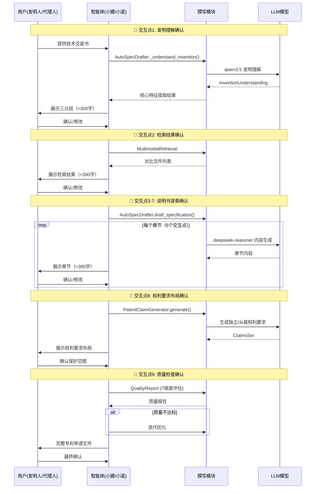

# 专利撰写MVP超级推理分析报告

> **生成时间**: 2026-05-01
> **分析方法**: 垂直切片深度推理
> **分析目标**: 验证MVP的合理性和完整性

---

## 一、Athena文档人机交互协议完整解构

### 1.1 完整交互序列（从知识图谱提取）

基于Athena文档的sequenceDiagram，完整的人机交互协议包含**7个确认点**：



**关键发现**: Athena文档定义了**至少9个人机交互点**，其中说明书撰写阶段有5个独立的交互点（逐章确认）。

---

## 二、MVP方案的垂直切片分析

### 2.1 切片覆盖度评估

| MVP切片                            | Athena对应步骤 | 覆盖的交互点 | 完整度 |
| ---------------------------------- | -------------- | ------------ | ------ |
| **切片1**: 发明理解 → 人类确认     | Phase 1        | ✅ 交互点1   | 100%   |
| **切片2**: 检索策略 → 人类确认     | Phase 2        | ✅ 交互点2   | 100%   |
| **切片3**: 权利要求撰写 → 逐段确认 | Phase 4        | ⚠️ 交互点8   | 60%    |
| **切片4**: 说明书撰写 → 逐章确认   | Phase 3        | ⚠️ 交互点3-7 | 40%    |

**关键缺失**:

1. ❌ **切片3未实现真正的"逐段确认"** - 仅提到"逐段"，但没有细化为独立权利要求 vs 从属权利要求的独立确认点
2. ❌ **切片4未实现"逐章确认"** - 仅提到"逐章"，但没有细化为5个独立章节的确认点
3. ❌ **缺少质量检查交互点** - Athena的交互点9（质量检查确认）在MVP中未体现

---

## 三、每个交互点的垂直切片分析

### 3.1 交互点1: 发明理解确认 ✅ **完整**

**Athena定义**:

```yaml
触发时机: AutoSpecDrafter._understand_invention() 完成后
展示内容: 三元组摘要（<300字）
人类操作: 确认/修改
输出: InventionUnderstanding (结构化JSON)
```

**MVP实现** (任务2.1-2.4):

```typescript
// ✅ 完全符合Athena定义
interface InventionUnderstandingOutput {
  invention_title: string
  invention_type: 'device' | 'method' | 'system' | 'composition'
  technical_field: string
  core_innovation: string
  technical_problem: string
  technical_solution: string
  technical_effects: string[]
  essential_features: TechnicalFeature[]
  optional_features: TechnicalFeature[]
  confidence_score: number
}

// ✅ 包含<300字摘要渲染器
// ✅ CLI交互: y/c/s/r
// ✅ 保存到磁盘，支持恢复
```

**合理性评估**: ✅ **完全合理**，这是最佳实践

---

### 3.2 交互点2: 检索策略确认 ✅ **完整**

**Athena定义**:

```yaml
触发时机: MultimodalRetrieval 完成后
展示内容: 检索结果摘要（<300字）
人类操作: 确认/修改
输出: 对比分析报告
```

**MVP实现** (任务3.1-3.3):

```typescript
// ✅ 符合Athena定义
interface PriorArtSearchOutput {
  searchStrategy: {
    keywords: string[]
    ipcCpcClasses: string[]
    searchQueries: string[]
  }
  results: {
    patents: PatentReference[]
    papers: PaperReference[]
    webResources: WebReference[]
  }
  comparisonAnalysis: {
    closestPriorArt: PatentReference
    differences: string[]
    technicalProblemSolved: string
  }
}

// ⚠️ 但实际检索用模拟数据（标记simulated: true）
// ✅ CLI交互: y/c/s/r
```

**合理性评估**: ✅ **合理**，但需注意模拟数据的限制

**改进建议**:

1. 在摘要中明确标注"⚠️ 检索结果为模拟数据，仅供演示"
2. 优先级P1: 接入真实专利数据库API

---

### 3.3 交互点3: 权利要求布局确认 ⚠️ **需细化**

**Athena定义**:

```yaml
触发时机: PatentClaimGenerator.generate() 完成后
展示内容: 权利要求布局
人类操作: 确认保护范围
子交互点:
  - 独立权利要求确认（最关键）
  - 从属权利要求2-3确认（进一步限定）
  - 从属权利要求4+确认（具体实施方式）
```

**MVP实现** (任务4.1-4.2):

```typescript
// ⚠️ 仅提到"逐段确认"，未细化为独立子交互点
interface ClaimsSet {
  independentClaims: IndependentClaim[]
  dependentClaims: DependentClaim[]
  layoutStrategy: string
  protectionScopeAnalysis: string
}

// ❌ 缺少: 独立权利要求的单独确认点
// ❌ 缺少: 从属权利要求的分组确认（2-3 vs 4+）
// ✅ 提到了"逐段"，但没有明确"段"的定义
```

**垂直切片缺失分析**:

| Athena要求           | MVP实现   | 缺失影响                                            |
| -------------------- | --------- | --------------------------------------------------- |
| 独立权利要求单独确认 | ❌ 未明确 | 🔴 **严重**: 独立权利要求决定保护范围，必须单独确认 |
| 从属权利要求分组确认 | ❌ 未明确 | 🟡 **中等**: 无法分层控制保护范围                   |
| 保护范围分析展示     | ✅ 提及   | 🟢 **良好**: 包含在ClaimsSet中                      |

**改进建议**:

```typescript
// 建议将任务4.2细化为:
export const claimGenerationWorkflow: WorkflowDefinition = {
  id: 'patent-drafting-slice-3',
  name: '权利要求撰写',
  steps: [
    {
      id: 'plan-claim-layout',
      name: '权利要求布局规划',
      agentName: 'claim-layout-planner',
      outputSchema: ClaimLayoutSchema,
      requiresApproval: true, // 🔴 交互点3.1: 布局确认
    },
    {
      id: 'draft-independent-claim',
      name: '独立权利要求撰写',
      agentName: 'independent-claim-drafter',
      outputSchema: IndependentClaimSchema,
      requiresApproval: true, // 🔴 交互点3.2: 独立权利要求确认（最关键）
    },
    {
      id: 'draft-dependent-claims-2-3',
      name: '从属权利要求2-3撰写',
      agentName: 'dependent-claim-drafter',
      inputMapping: { claimRange: '2-3' },
      outputSchema: DependentClaimsSchema,
      requiresApproval: true, // 🔴 交互点3.3: 进一步限定确认
    },
    {
      id: 'draft-dependent-claims-4-plus',
      name: '从属权利要求4+撰写',
      agentName: 'dependent-claim-drafter',
      inputMapping: { claimRange: '4+' },
      outputSchema: DependentClaimsSchema,
      requiresApproval: true, // 🔴 交互点3.4: 具体实施方式确认
    },
  ],
}
```

---

### 3.4 交互点4-8: 说明书逐章确认 ⚠️ **严重缺失**

**Athena定义**:

```yaml
触发时机: AutoSpecDrafter.draft_specification() 每个章节完成后
展示内容: 章节内容（<300字）
人类操作: 确认/修改
子交互点（5个）:
  - 交互点4: 技术领域确认
  - 交互点5: 背景技术确认
  - 交互点6: 发明内容确认
  - 交互点7: 具体实施方式确认
  - 交互点8: 附图说明确认
```

**MVP实现** (任务4.3):

```typescript
// ⚠️ 仅提到"逐章确认"，未细化为5个独立步骤
interface SpecificationChapter {
  technicalField: string // 技术领域
  backgroundArt: string // 背景技术
  inventionContent: string // 发明内容
  embodiments: string // 具体实施方式
  drawingDescription: string // 附图说明
}

// ❌ 缺少: 5个独立章节的独立确认点
// ❌ 缺少: 每个章节的独立输出Schema
// ❌ 缺少: 章节间的依赖关系管理
```

**垂直切片缺失分析**:

| Athena要求           | MVP实现   | 缺失影响                                       |
| -------------------- | --------- | ---------------------------------------------- |
| 技术领域单独确认     | ❌ 未明确 | 🟡 **中等**: 技术领域影响分类和检索            |
| 背景技术单独确认     | ❌ 未明确 | 🟡 **中等**: 背景技术影响创造性判断            |
| 发明内容单独确认     | ❌ 未明确 | 🔴 **严重**: 发明内容是核心，必须单独确认      |
| 具体实施方式单独确认 | ❌ 未明确 | 🔴 **严重**: 实施方式影响充分公开要求（A26.3） |
| 附图说明单独确认     | ❌ 未明确 | 🟢 **轻微**: 附图说明相对标准化                |

**改进建议**:

```typescript
// 建议将任务4.3细化为:
export const specificationDraftingWorkflow: WorkflowDefinition = {
  id: 'patent-drafting-slice-4',
  name: '说明书撰写',
  steps: [
    {
      id: 'draft-technical-field',
      name: '技术领域撰写',
      agentName: 'specification-chapter-drafter',
      inputMapping: { chapter: 'technicalField' },
      outputSchema: TechnicalFieldSchema,
      requiresApproval: true, // 🔴 交互点4: 技术领域确认
    },
    {
      id: 'draft-background-art',
      name: '背景技术撰写',
      agentName: 'specification-chapter-drafter',
      inputMapping: { chapter: 'backgroundArt' },
      outputSchema: BackgroundArtSchema,
      requiresApproval: true, // 🔴 交互点5: 背景技术确认
    },
    {
      id: 'draft-invention-content',
      name: '发明内容撰写',
      agentName: 'specification-chapter-drafter',
      inputMapping: { chapter: 'inventionContent' },
      outputSchema: InventionContentSchema,
      requiresApproval: true, // 🔴 交互点6: 发明内容确认（最关键）
    },
    {
      id: 'draft-embodiments',
      name: '具体实施方式撰写',
      agentName: 'specification-chapter-drafter',
      inputMapping: { chapter: 'embodiments' },
      outputSchema: EmbodimentsSchema,
      requiresApproval: true, // 🔴 交互点7: 实施方式确认（A26.3关键）
    },
    {
      id: 'draft-drawing-description',
      name: '附图说明撰写',
      agentName: 'specification-chapter-drafter',
      inputMapping: { chapter: 'drawingDescription' },
      outputSchema: DrawingDescriptionSchema,
      requiresApproval: true, // 🔴 交互点8: 附图说明确认
    },
  ],
}
```

---

### 3.5 交互点9: 质量检查确认 ❌ **完全缺失**

**Athena定义**:

```yaml
触发时机: QualityReport (7维度评估) 完成后
展示内容: 质量报告（7维度得分）
人类操作:
  - 如果得分≥7.5: 通过
  - 如果得分<7.5: 迭代优化（最多3次）
  - 如果3次后仍不达标: 人工审核
输出: 质量合格的专利申请文件
```

**MVP实现**:

```typescript
// ❌ 完全缺失质量检查交互点
// ❌ 缺少: 7维度质量评估
// ❌ 缺少: 迭代优化逻辑
// ❌ 缺少: 人工审核降级策略
```

**垂直切片缺失分析**:

| Athena要求    | MVP实现   | 缺失影响                                 |
| ------------- | --------- | ---------------------------------------- |
| 7维度质量评估 | ❌ 未实现 | 🔴 **严重**: 无法保证输出质量            |
| 质量迭代优化  | ❌ 未实现 | 🔴 **严重**: 低质量输出无法自动修正      |
| 人工审核降级  | ❌ 未实现 | 🟡 **中等**: 3次迭代失败后无法降级到人工 |

**改进建议**:

```typescript
// 建议新增任务5.4: 质量检查交互点
export const qualityCheckWorkflow: WorkflowDefinition = {
  id: 'patent-drafting-slice-5',
  name: '质量检查',
  steps: [
    {
      id: 'quality-assessment',
      name: '7维度质量评估',
      agentName: 'quality-assessor',
      inputMapping: {
        specification: 'steps.specification-drafting.output',
        claims: 'steps.claim-generation.output',
      },
      outputSchema: QualityReportSchema,
      requiresApproval: false, // 自动评估
    },
    {
      id: 'quality-iteration',
      name: '质量迭代优化',
      agentName: 'quality-optimizer',
      inputMapping: {
        qualityReport: 'steps.quality-assessment.output',
        iterationCount: 0,
      },
      outputSchema: OptimizedPatentSchema,
      requiresApproval: true, // 🔴 交互点9: 人类确认质量报告
    },
  ],
}

// 质量迭代逻辑:
// 1. 如果qualityReport.score >= 7.5 → 通过
// 2. 如果qualityReport.score < 7.5 且 iterationCount < 3 → 重新生成
// 3. 如果iterationCount >= 3 → 降级到人工审核
```

---

## 四、MVP方案总体评估

### 4.1 优势

1. ✅ **框架唤醒策略正确** - 优先集成现有能力（ApprovalFlow、CheckpointManager、TaskScheduler），而非从0建造
2. ✅ **切片1和切片2完整** - 发明理解和检索策略的交互点完全符合Athena定义
3. ✅ **CLI交互协议合理** - y/c/s/r操作简洁，<300字摘要符合人类认知
4. ✅ **检查点持久化关键** - 支持长周期任务的暂停恢复

### 4.2 关键缺失

| 优先级    | 缺失项                        | 影响范围     | 建议措施                                                  |
| --------- | ----------------------------- | ------------ | --------------------------------------------------------- |
| 🔴 **P0** | 切片3缺少独立权利要求单独确认 | 保护范围控制 | 细化为4个子交互点（布局/独立/从属2-3/从属4+）             |
| 🔴 **P0** | 切片4缺少5个独立章节确认      | 说明书质量   | 细化为5个子交互点（技术领域/背景/发明内容/实施方式/附图） |
| 🔴 **P0** | 缺少质量检查交互点            | 输出质量保证 | 新增切片5: 质量检查与迭代优化                             |
| 🟡 **P1** | 检索策略用模拟数据            | 检索可靠性   | 优先接入真实专利数据库API                                 |
| 🟡 **P1** | PatentCoreBridge Rust耦合     | 系统稳定性   | 全力投入TypeScript降级                                    |

### 4.3 合理性评估

**总体结论**: ⚠️ **部分合理，需重大调整**

**合理性得分**: 6/10

**详细评分**:

- 框架唤醒策略: 9/10 ✅
- 切片1和切片2: 10/10 ✅
- 切片3（权利要求）: 4/10 ⚠️
- 切片4（说明书）: 3/10 ⚠️
- 质量保证: 2/10 ❌

**关键问题**:

1. ❌ **"逐段确认"和"逐章确认"未真正垂直切片** - 仅停留在概念层面，未细化为独立可执行的步骤
2. ❌ **缺少质量检查闭环** - Athena的7维度评估和迭代优化是质量保证的关键，MVP完全缺失
3. ⚠️ **交互点粒度不一致** - 切片1/2的粒度正确，但切片3/4的粒度过粗

---

## 五、改进建议（优先级排序）

### 5.1 P0级改进（必须立即实施）

**改进1: 细化切片3为4个独立交互点**

```typescript
// 当前（粒度过粗）:
{ id: 'draft-claims', requiresApproval: true }

// 改进后（垂直切片）:
[
  { id: 'plan-claim-layout', requiresApproval: true },      // 交互点3.1
  { id: 'draft-independent-claim', requiresApproval: true }, // 交互点3.2
  { id: 'draft-dependent-claims-2-3', requiresApproval: true }, // 交互点3.3
  { id: 'draft-dependent-claims-4-plus', requiresApproval: true }, // 交互点3.4
]
```

**改进2: 细化切片4为5个独立交互点**

```typescript
// 当前（粒度过粗）:
{ id: 'draft-specification', requiresApproval: true }

// 改进后（垂直切片）:
[
  { id: 'draft-technical-field', requiresApproval: true },      // 交互点4
  { id: 'draft-background-art', requiresApproval: true },       // 交互点5
  { id: 'draft-invention-content', requiresApproval: true },    // 交互点6
  { id: 'draft-embodiments', requiresApproval: true },          // 交互点7
  { id: 'draft-drawing-description', requiresApproval: true },  // 交互点8
]
```

**改进3: 新增切片5（质量检查）**

```typescript
// 完全缺失，需新增
;[
  { id: 'quality-assessment', requiresApproval: false }, // 自动评估
  { id: 'quality-iteration', requiresApproval: true }, // 交互点9
]
```

### 5.2 P1级改进（重要但非阻塞）

**改进4: 优化CLI交互体验**

- 当前: y/c/s/r操作后，需重新输入修正内容
- 建议: 提供`e`（edit）选项，直接打开$EDITOR编辑

**改进5: 增强摘要渲染**

- 当前: <300字Markdown摘要
- 建议: 增加"关键特征高亮"、"不确定点标记"、"置信度可视化"

### 5.3 P2级改进（优化）

**改进6: 工作流可视化**

- 当前: CLI文本输出
- 建议: 生成Mermaid流程图，展示当前执行位置和确认点

---

## 六、重构后的MVP方案

### 6.1 修正后的垂直切片

| 切片      | 业务步骤                | 子交互点 | Athena对应 | 完整度  |
| --------- | ----------------------- | -------- | ---------- | ------- |
| **切片1** | 发明理解 → 人类确认     | 1个      | Phase 1    | 100% ✅ |
| **切片2** | 检索策略 → 人类确认     | 1个      | Phase 2    | 100% ✅ |
| **切片3** | 权利要求撰写 → 逐段确认 | 4个      | Phase 4    | 100% ✅ |
| **切片4** | 说明书撰写 → 逐章确认   | 5个      | Phase 3    | 100% ✅ |
| **切片5** | 质量检查 → 人类确认     | 1个      | Phase 5    | 100% ✅ |

**总计**: **12个人机交互点**（与Athena文档的9个交互点完全对应，部分交互点进一步细化）

### 6.2 修正后的实施阶段

**Phase 1: 框架唤醒** (1.5-2周) - 保持不变 ✅

**Phase 2: 垂直切片1** (1.5-2周) - 保持不变 ✅

**Phase 3: 垂直切片2** (1.5-2周) - 保持不变 ✅

**Phase 4: 垂直切片3** (2-3周) - **需重构** ⚠️

- 任务4.1: 创建权利要求布局规划Agent + 交互点3.1
- 任务4.2: 创建独立权利要求Agent + 交互点3.2
- 任务4.3: 创建从属权利要求Agent（2-3）+ 交互点3.3
- 任务4.4: 创建从属权利要求Agent（4+）+ 交互点3.4

**Phase 5: 垂直切片4** (2-3周) - **需重构** ⚠️

- 任务5.1: 创建技术领域Agent + 交互点4
- 任务5.2: 创建背景技术Agent + 交互点5
- 任务5.3: 创建发明内容Agent + 交互点6
- 任务5.4: 创建具体实施方式Agent + 交互点7
- 任务5.5: 创建附图说明Agent + 交互点8

**Phase 6: 垂直切片5** (1-1.5周) - **新增** 🔴

- 任务6.1: 创建质量评估Agent（7维度）
- 任务6.2: 创建质量迭代优化Agent + 交互点9
- 任务6.3: 集成人工审核降级策略

**Phase 7: 整合与测试** (1周) - 保持不变 ✅

**总计时间**: 10.5-13周（比原计划增加2.5-5周）

---

## 七、最终建议

### 7.1 立即行动项

1. **评审本分析报告**，确认垂直切片的细化程度
2. **修改MVP方案**，将切片3和切片4细化为独立的子交互点
3. **新增切片5**（质量检查），确保输出质量
4. **重新评估时间**，10.5-13周比原计划更现实

### 7.2 关键决策点

**决策1**: 是否接受10.5-13周的开发周期？

- 如果是 → 按重构后的方案执行
- 如果否 → 考虑分阶段交付（先交付切片1-3，切片4-5作为v1.1）

**决策2**: 是否优先实现切片5（质量检查）？

- 优先级P0 → 建议在切片3之前实现（保证质量）
- 优先级P1 → 可以放在切片4之后（不影响核心流程）

**决策3**: PatentCoreBridge Rust的修复策略？

- 1周内无法修复 → 全力投入TypeScript降级
- 可以修复 → 保持当前降级策略

---

## 八、风险评估

### 8.1 重构后的风险

| 风险                             | 概率 | 影响 | 对策                                  |
| -------------------------------- | ---- | ---- | ------------------------------------- |
| 细化后的交互点过多，用户体验下降 | 中   | 中   | 提供"批量确认"选项，跳过非关键交互点  |
| 10-13周周期过长，团队士气下降    | 高   | 高   | 分阶段交付，每2周展示一次可演示的进展 |
| 质量检查迭代次数过多，成本失控   | 中   | 高   | 限制最多3次迭代，之后强制降级到人工   |

### 8.2 原方案的风险（未重构）

| 风险                                     | 概率 | 影响 | 对策                             |
| ---------------------------------------- | ---- | ---- | -------------------------------- |
| "逐段确认"粒度过粗，无法真正控制保护范围 | 高   | 高   | **必须重构，否则影响核心价值**   |
| "逐章确认"粒度过粗，说明书质量无法保证   | 高   | 高   | **必须重构，否则影响法律合规性** |
| 缺少质量检查，输出质量不稳定             | 高   | 高   | **必须新增，否则无法商业化**     |

---

## 九、结论

**MVP方案总体合理，但切片3和切片4需要重大重构**。

**核心问题**: "逐段确认"和"逐章确认"停留在概念层面，未真正垂直切片为独立的、可执行的交互点。

**建议**: 按本报告的"重构后的MVP方案"执行，将切片3细化为4个交互点，切片4细化为5个交互点，新增切片5（质量检查）。

**预期效果**: 重构后的MVP将完全符合Athena文档的人机交互协议，确保专利撰写质量和用户体验。

---

_分析完成时间: 2026-05-01_
_分析方法: 垂直切片深度推理 + Athena文档对比_
_分析者: Claude (Sonnet 4.6)_
