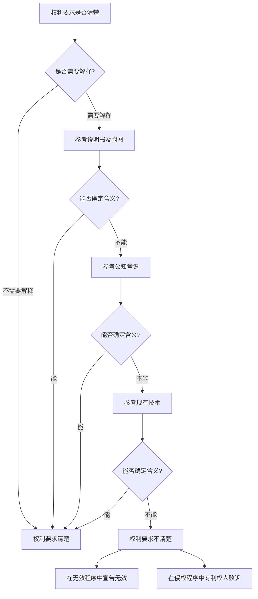

# 侵权-原理-权利要求不清楚

> **来源：** 崔国斌《专利法：原理与案例（第二版）》第10章 §3.3
> **核心法条：** 《专利法》第26条第4款、《专利法实施细则》第20条第1款
> **关联页面：** [[侵权-原理-权利要求解释原理]]、[[权利要求-清楚的要求]]、[[说明书-清楚与完整]]、[[侵权-原理-功能性限定特征]]、[[../专利侵权/权利保护范围/权利保护范围-澄清弥补与修正]]

---

## 核心要点

权利要求解释的理想结果是解释者能够确定权利要求的确切含义从而准确界定专利权的保护范围。如果穷尽一切解释方法仍不能确定权利要求中特定术语的确切含义，在专利权无效宣告程序中会导致专利权被宣告无效，在侵权诉讼中会导致专利权人因无法完成举证责任而败诉。

---

## 1. 权利要求不清楚的后果

### 在无效宣告程序中

权利要求不清楚是专利无效的法定理由之一。根据《专利法》第26条第4款和《专利法实施细则》第20条第1款的规定，权利要求应当清楚、简要地表述请求保护的范围。如果权利要求的撰写存在明显瑕疵，结合涉案专利说明书、本领域的公知常识以及相关现有技术等，仍然不能确定权利要求中技术术语的具体含义，无法准确确定专利权的保护范围，则应当宣告该专利权无效。

### 在侵权诉讼中

在侵权诉讼中，如果权利要求的保护范围不清楚，专利权人无法完成其举证责任——证明被控侵权的方案落入了专利权的保护范围。法院不能基于不清楚的权利要求认定侵权。

### 案例：柏万清 v. 成都难寻物品营销服务中心

**审理法院：** 最高人民法院（2012）民申字第1544号

- **争议焦点：** 权利要求中"导磁率高"这一技术术语的范围是否明确
- **决定要点：**
  1. **权利要求不清楚导致无法侵权对比：** 准确界定专利权的保护范围，是认定被诉侵权技术方案是否构成侵权的前提条件。如果权利要求的撰写存在明显瑕疵，结合涉案专利说明书、本领域的公知常识以及相关现有技术等，仍然不能确定权利要求中技术术语的具体含义，无法准确确定专利权的保护范围的，则无法将被诉侵权技术方案与之进行有意义的侵权对比。因此，对于保护范围明显不清楚的专利权，不应认定被诉侵权技术方案构成侵权。

  2. **"导磁率高"含义的不确定性：** 根据柏万清提供的证据，虽然磁导率有时也被称为导磁率，但磁导率有绝对磁导率与相对磁导率之分，根据具体条件的不同还涉及起始磁导率μi、最大磁导率μm等概念。不同概念的含义不同，计算方式也不尽相同。磁导率并非常数，磁场强度H发生变化时，即可观察到磁导率的变化。但是在涉案专利说明书中，既没有记载导磁率在涉案专利技术方案中是指相对磁导率还是绝对磁导率或者其他概念，也没有记载导磁率高的具体范围，亦没有记载包括磁场强度H等在内的计算导磁率的客观条件。本领域技术人员根据涉案专利说明书，难以确定涉案专利中所称的导磁率高的具体含义。

  3. **高导磁率含义的宽泛性：** 从柏万清提交的相关证据来看，虽能证明有些现有技术中确实采用了高磁导率、高导磁率等表述，但根据技术领域以及磁场强度的不同，所谓高导磁率的含义十分宽泛，从80 Gs/Oe至83.5×10⁴ Gs/Oe均被柏万清称为高导磁率。柏万清提供的证据并不能证明在涉案专利所属技术领域中，本领域技术人员对于高导磁率的含义或者范围有着相对统一的认识。

  4. **专利权人主张的不合理性：** 柏万清主张根据具体使用环境的不同，本领域技术人员可以确定具体的安全下限，从而确定所需的导磁率。该主张实际上是将能够实现防辐射目的的所有情形均纳入涉案专利权的保护范围，保护范围过于宽泛，亦缺乏事实和法律依据。

  5. **司法鉴定无必要：** 综上所述，根据涉案专利说明书以及柏万清提供的有关证据，本领域技术人员难以确定权利要求1中技术特征"导磁率高"的具体范围或者具体含义，不能准确确定权利要求1的保护范围，无法将被诉侵权产品与之进行有意义的侵权对比。因此，对被诉侵权产品的导磁率进行司法鉴定已无必要。

- **启示：** 权利要求保护范围清楚是专利权有效行使的前提，专利申请人应当在权利要求中明确界定技术术语的具体含义，否则在侵权诉讼中难以获得保护。

---

## 2. 权利要求不清楚的判断标准

### 判断方法

判断权利要求是否清楚，应当考虑以下因素：

1. **结合说明书：** 权利要求不清楚时，应当结合说明书及附图进行解释。说明书和附图是理解权利要求含义的重要依据。

2. **考虑公知常识：** 本领域的公知常识和技术惯例也是判断权利要求含义的重要参考。

3. **参考现有技术：** 在某些情况下，现有技术的相关内容也有助于理解权利要求的含义。

### 判断步骤

---

## 3. 如何避免权利要求不清楚

### 申请人的注意事项

1. **明确技术术语的含义：** 对于可能引起歧义的技术术语，应当在权利要求或说明书中明确其含义。

2. **限定技术参数的范围：** 对于涉及技术参数（如温度、压力、浓度、磁导率等）的权利要求，应当明确参数的具体范围或定义。

3. **避免过于宽泛的表述：** 尽量避免使用"高"、"低"、"强"、"弱"等相对性强的形容词，除非在说明书中明确其含义。

4. **与说明书保持一致：** 权利要求中的术语应当与说明书中的表述保持一致。

### 说明书的辅助作用

在说明书中，可以通过以下方式帮助明确权利要求的含义：

1. **定义技术术语：** 对权利要求中使用的特殊技术术语进行明确定义。

2. **说明技术参数：** 对权利要求中涉及的技术参数进行具体说明，包括参数的计算方法、测试条件等。

3. **提供实施例：** 通过具体的实施例说明权利要求的含义。

---

## 4. 思考问题

### 问题1

在说明书中做什么样的说明可以帮助申请人克服本案的困难？

**分析：** 如果在专利说明书中：
- 明确指出"导磁率高"是指相对磁导率还是绝对磁导率
- 说明导磁率高的具体数值范围（如"相对磁导率大于1000"）
- 说明测试导磁率的具体条件（如磁场强度、温度等）
- 提供具体的实施例及对应的导磁率数值

这样本领域技术人员就能够确定"导磁率高"的具体含义，权利要求的保护范围也会变得清楚。

### 问题2

假定被告所实施的方案刚好是发明人所列举的实施例之一，法院应该如何处理？结论还一样吗？

**分析：** 这是一个有争议的问题。从理论上说：

1. **支持专利权人的观点：** 如果被告实施的就是发明人明确披露的实施例，那么被告无疑应该承担侵权责任。在这种情况下，即使权利要求某些术语不清楚，法院也可以基于说明书实施例来认定侵权。

2. **反对的观点：** 权利要求的保护范围是由权利要求本身界定的，而不是由说明书的实施例界定的。即使被告实施的是说明书的实施例，如果权利要求本身不清楚，也不能通过解释将实施例的特征读入权利要求来认定侵权。

3. **折中的观点：** 法院可以基于"禁止反悔"原则，认为专利权人在说明书中披露的实施例代表了其对发明保护范围的理解，如果被告实施的是这些实施例，那么专利权人不能因为这些实施例未在权利要求中明确记载而主张其不在保护范围内。

在实践中，这个问题还没有得到明确的解决，可能需要最高人民法院通过判例进一步明确。

---

## 5. 与无效宣告程序的关系

### 无效宣告理由

根据《专利法》第26条第4款，权利要求不清楚是专利无效的法定理由之一。在无效宣告程序中，如果专利权利要求保护范围不清楚，专利复审委员会（现专利复审和无效审理部）可以宣告该专利权无效。

### 与侵权诉讼的衔接

1. **先无效后侵权：** 如果专利权人起诉侵权，被告通常会在答辩期间提起专利无效宣告请求。如果专利被宣告无效，侵权诉讼自然终止。

2. **权利要求清楚性审查：** 在侵权诉讼中，法院也可以主动审查权利要求是否清楚。如果发现权利要求不清楚，法院可以驳回原告的诉讼请求。

3. **中止诉讼：** 在侵权诉讼中，如果被告提起无效宣告请求，法院通常中止诉讼，等待无效宣告结果。

---

## 本页典型案例索引

| 决定编号 | 案件编号 | 主题 | 关联章节 |
|---------|---------|------|---------|
| 最高人民法院（2012）民申字第1544号 | 柏万清 v. 成都难寻物品营销服务中心 | 权利要求不清楚导致无法认定侵权 | 权利要求-清楚的要求 |
