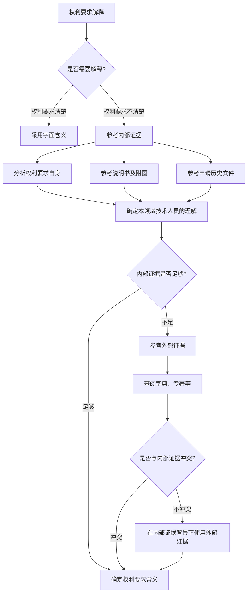

# 侵权-原理-权利要求解释原理

> **来源：** 崔国斌《专利法：原理与案例（第二版）》第10章 §3.1
> **核心法条：** 《专利法》（2008）第59条
> **关联页面：** [[侵权-原理-多余指定规则]]、[[侵权-原理-权利要求不清楚]]、[[侵权-原理-功能性限定特征]]、[[权利要求-清楚的要求]]、[[权利要求-以说明书为依据]]
> **比较法内容：** 本页包含比较法分析，供参考。以中国《专利法》及审查实践为准。

---

## 核心要点

权利要求解释的目标是确定本领域普通技术人员所理解的申请人原本赋予权利要求的客观含义，而非专利申请人的主观意图。解释过程需遵循"以权利要求的内容为准"的基本原则，利用说明书、附图等内部证据解释权利要求，同时可以参考字典等外部证据，但不得将说明书中的限制读入权利要求。

---

## 1. 权利要求解释的目标

### 基本规则

权利要求解释的最终目的是确定**熟练技术人员所理解的申请人原本赋予权利要求的确切含义**。这一解释是在确定权利要求的相对客观的含义（相对于熟练技术人员），而非专利申请人纯粹主观的真实意思。申请人的主观意思只有能够被熟练技术人员感知时才能够起到界定权利要求范围的作用。

### 自行创设技术术语的处理

在新技术领域，发明人可能需要使用自行创设的技术术语来描述某些技术特征。在这种情况下：

- 允许专利申请人使用自行创设的技术术语
- 申请人有义务在权利要求书或专利说明书中对该技术术语进行清楚、准确地定义或说明
- 确定含义时应当综合考虑权利要求书、说明书、附图中记载的相关技术内容

### 案例：上海摩的露可锁具制造厂 v. 上海固坚锁业有限公司

**审理法院：** 最高人民法院（2013）民提字第113号

- **争议焦点：** 自行创设的技术术语"伸缩联动器"的含义如何确定
- **决定要点：** 伸缩联动器并非涉案专利申请日前本领域中已有的技术术语，是专利申请人自行创设的技术术语。确定自行创设的技术术语的含义时，应当综合考虑权利要求书、说明书、附图中记载的与该技术术语相关的技术内容。权利要求书、说明书中对该技术术语进行了清楚、明确的定义或解释的，一般可依据该定义或解释来确定其含义；若未能进行清楚、明确的定义或解释，则应当结合说明书、附图中记载的与该技术术语有关的背景技术、技术问题、发明目的、技术方案、技术效果等内容，查明该技术术语相关的工作方式、功能、效果。
- **启示：** 发明人在申请专利时若使用自行创设的技术术语，必须在专利文献中进行明确界定，否则将导致权利要求范围不确定的风险。

---

## 2. 权利要求解释的原则

### 基本原则

权利要求解释要遵循诸多的法律原则：

1. **权利要求的统治地位**：确立权利要求本身在界定保护范围方面的统治地位，即强调以"权利要求的内容为准"。解释者要做的工作是解释，而不是重写权利要求。

2. **说明书及附图的解释作用**：在权利要求字面内容不清楚、需要解释的情况下，可以利用说明书及附图来解释权利要求的内容。权利要求以外的文件只能用来解释，而不是直接限定权利要求。

3. **专利法特有的解释规则**：包括禁止反悔原则、捐献原则、功能性限定语言的解释规则等。

### 解释原则的体现

美国Autogiro Co. of America v. United States案阐述了专利侵权判断过程中的诸多基本问题。该案指出：

- 专利的权利要求对发明进行简洁而正式的定义
- 法院不能拓宽也不能限缩权利要求，以至于使得专利权人得到不同于他当初界定的东西
- 法院受制于权利要求的语言，但在解释权利要求的含义时，并不局限于权利要求的文字
- 权利要求表面看来不可能是清楚而不模糊的，必须联系专利文献的其他部分以及专利申请的产生背景进行解释

### 思考问题

1. "法院不能拓宽也不能限缩权利要求，以至于使得专利权人得到不同于他当初界定的东西。"权利要求解释真的只是要努力理解专利权人"当初界定的东西"？

2. 法院在解释权利要求时，如何受制于但又不能局限于权利要求的文字？

---

## 3. 内部证据：说明书的作用

### 基本规则

《专利法》（2008）第59条规定："发明或者实用新型专利权的保护范围以其权利要求的内容为准，说明书及附图可以用于解释权利要求的内容。"

说明书在解释权利要求方面的作用非常微妙：

- 强调以"权利要求的内容为准"，意味着解释者一般不能将说明书或附图中"有"但权利要求中"无"的特征读入权利要求
- 但权利要求中"有"和"无"的判断并非简单地依据权利要求字面表述
- 熟练技术人员通过阅读说明书及附图，相信该未提及的特征也是权利要求所覆盖发明的定义特征之一，则解释者应当通过文字解释将该特征纳入诉争权利要求

### 案例：宁波市东方机芯总厂 v. 江阴金铃五金制品有限公司

**审理法院：** 最高人民法院（2001）民三提字第1号

- **争议焦点：** 说明书实施例中记载的"盲板不是呈悬臂状"是否能够限制权利要求保护范围
- **决定要点：** 按照权利要求不应该解释成局限于专利的实施例这一公认的原则，说明书和附图只有在权利要求书记载的内容不清楚时，才能用来澄清权利要求书中模糊不清的地方，说明书和附图不能用来限制权利要求书中已经明确无误记载的权利要求的范围。说明书中的实施例是说明书的组成部分，是专利技术的最佳实施方案，不是专利技术的全部内容，实施例不能用来确定专利权的保护范围。
- **启示：** 说明书实施例不应被视为对权利要求范围的排他性限定，除非有明确的排除性表述。

### 案例：OBE公司 v. 浙江康华眼镜有限公司

**审理法院：** 最高人民法院（2008）民申字第980号

- **争议焦点：** "切割出大致与铰接件外形一致的区域"是否应解释为"铰接件与金属带不分离"
- **决定要点：** 根据说明书记载，涉案专利的发明目的在于提供一种弹簧铰链的经济制作方法，并改进零件的组装和搬运，产生良好的经济效益。说明书及附图中均记载了铰接件始终属于金属带的一部分，直至将锁紧件、弹簧件、套环等安装在制成的铰接件上之后，才将铰接件从金属带上切掉。权利要求3、4的附加技术特征亦能印证对"切割出大致与铰接件外形一致的区域"所做的上述解释。申请审查档案亦表明权利要求1中"大致与铰接件外形一致的区域"仍然是金属带的一部分，该区域未与金属带分离。
- **启示：** 在解释权利要求术语时，应综合考虑说明书、附图、权利要求书的其他权利要求以及申请审查档案等多方面因素，以确定该领域普通技术人员所理解的含义。

---

## 4. 外部证据：字典的作用

### 基本规则

外部证据包括专家和发明人证词、字典、权威著作等。在权利要求解释方面：

- 外部证据整体而言没有专利和它的申请历史文件可靠
- 字典定义的价值在于，它是一种公众在诉讼之前就可以获取的没有偏见的资料来源
- 法院可以自由地使用字典和技术专著，但字典定义不应与通过阅读专利文献所发现或确定的任何定义相矛盾

### 案例：Phillips v. AWH Corp.

**审理法院：** 美国联邦巡回上诉法院 415 F.3d 1303（2005）

- **争议焦点：** 权利要求术语"缓冲隔板"的含义如何确定，应参考哪些证据
- **决定要点：** 权利要求的解释要体现发明所在领域的普通技术人员的眼光。权利要求中词语一般应被赋予其通常和习惯的含义，即发明之时对该领域熟练技术人员而言该术语所具有的含义。该领域普通技术人员不仅仅要在特定权利要求的背景下阅读该诉争的权利要求术语，而且要在整个专利（包含说明书）的背景下阅读该术语。法院应当根据专利法上的法律和政策赋予内部证据和外部证据适当的权重。
- **启示：** 权利要求解释应以内部证据（权利要求、说明书、申请历史）为基础，外部证据在内部证据背景下考虑，不得用来改变或贬低权利要求的公共记录功能。

### 中国法院的实践

在范志宁 v. 常州智力微创医疗器械有限公司案中，法院指出："对于权利要求中表述模糊不清、有争议概念或者表述，应当首先依照专利说明书进行解释和理解，只有在说明书也没有作出相关说明或者说明不清晰、不充分的情况下，才引用字典、辞典的解释。"

### 思考问题

1. 为什么法院觉得，从字典出发解释权利要求，会系统性地导致权利要求解释的结果过于宽泛？

2. 从说明书出发，如何防止法院将说明书中的限制性特征读入权利要求？

3. 在解释权利要求时，为什么"内部证据"比"外部证据"要重要？

---

## 5. 法律问题与事实问题的二分

### 基本规则

在美国，权利要求解释被认为是一个法律问题，由法官而非陪审团决定。而对于技术方案相同或等同的认定，则被认为是事实问题，由陪审员决定。

在中国法上，单纯区分法律问题或事实问题没有美国法上的重要意义。但在很多专利侵权案件中，法院常常借助于外部的专家鉴定。这时候，究竟许可技术专家对哪些问题作出鉴定，则牵涉到法律或事实的区分。

### 案例：爱蓝天高新技术材料（大连）有限公司 v. 湖南科力远新能源股份有限公司

**审理法院：** 江苏省高院（2011）苏知民再终字第0001号

- **争议焦点：** 司法鉴定的范围应如何界定，技术专家可以对哪些问题发表意见
- **决定要点：** 司法鉴定应限于解决技术事实存在与否，而不能用于解决如何认定某一事实的方法问题及是否构成相同或近似的问题，人民法院有权根据案件具体情形决定是否委托司法技术鉴定。法院可以根据《最高人民法院关于民事诉讼证据的若干规定》第六十一条的规定，要求双方当事人提供专家辅助人参与诉讼，就涉案技术的专门性问题向法庭作出说明。
- **启示：** 在专利侵权诉讼中，技术鉴定的范围应限于技术事实的查明，不应包括对权利要求含义的法律解释。

---

## 判断流程

---

## 本页典型案例索引

| 决定编号 | 案件编号 | 主题 | 关联章节 |
|---------|---------|------|---------|
| 最高人民法院（2013）民提字第113号 | 上海摩的露可锁具制造厂 v. 上海固坚锁业有限公司 | 自行创设技术术语的含义确定 | 权利要求-清楚的要求 |
| 最高人民法院（2001）民三提字第1号 | 宁波市东方机芯总厂 v. 江阴金铃五金制品有限公司 | 说明书实施例对权利要求的限制 | 权利要求-以说明书为依据 |
| 最高人民法院（2008）民申字第980号 | OBE公司 v. 浙江康华眼镜有限公司 | 说明书及申请历史文件对权利要求的解释 | 权利要求-以说明书为依据 |
| 美国联邦巡回上诉法院 415 F.3d 1303 | Phillips v. AWH Corp. | 权利要求解释中内部证据与外部证据的关系 | 权利要求-清楚的要求 |
| 江苏省高院（2011）苏知民再终字第0001号 | 爱蓝天高新技术材料（大连）有限公司 v. 湖南科力远新能源股份有限公司 | 技术鉴定范围的界定 | 程序 |
