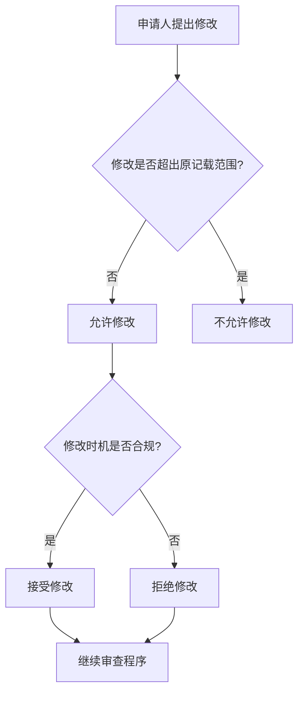

# 程序-原理-专利申请的修改

> **来源：** 崔国斌《专利法:原理与案例(第二版)》第7章 §2.1-2.4
> **核心法条：** 《专利法》第33条,《专利法实施细则》第51-68条
> **关联页面：** [[程序-原理-申请文件]]、[[修改-修改依据与超范围判断|修改-概述]]、[[修改-修改依据与超范围判断|修改-基于公知常识的技术特征改变]]

---

## 核心要点

专利申请人可以对专利申请文件进行修改,但修改不得超出原说明书和权利要求书记载的范围。判断修改是否超范围的标准是本领域技术人员能否从原申请文件中"直接地、毫无疑义地确定"修改内容。

---

## 1. 允许的修改

### 基本规则

中国《专利法》第33条规定:"申请人可以对其专利申请文件进行修改,但是,对发明和实用新型专利申请文件的修改不得超出原说明书和权利要求书记载的范围,对外观设计专利申请文件的修改不得超出原图片或者照片表示的范围。"

既然修改不能超出原始的记载范围,那为什么还要许可修改呢?理论上,虽然原始的说明书或权利要求表达不够明确或规范,但是,如果经过法定程序我们能够探究明白需要修改的部分的真实含义,则补救性的修改并无必要。不过,在启动法定程序进行调查之前,公众或审查员可能会错误地理解专利权范围和并对专利权效力产生误解。许可申请人修改专利申请文件,可以提前消除这种误解,从而促进社会公益。

### 修改的对象和范围

可修改的专利申请文件应涵盖说明书、摘要和权利要求。专利法对于申请文件修改的限制应该是针对与发明人的描述自己发明内容和权利要求有关的部分。发明人对于与发明内容无关的现有技术描述部分的文字修改,比如,增加或删除现有技术文献的引用,无论是否得当,通常不会对专利申请的时间利益和保护范围产生实质性影响。但这并不意味着专利局可以任意许可申请人增删现有技术描述的内容。从程序效率的角度看,即便增加这些与发明内容或保护范围无关的内容,也必然会引起审查员的关注,从而耗费审查资源。

在特殊情况下,增删现有技术等看似与发明内容无关的背景内容也可能会导致熟练技术人员阅读专利申请文件时对发明内容的理解发生改变。因此,专利局对申请人的此类修改也应持限制态度。如果与公众理解发明内容无关,则很难理解为什么申请人要通过修改增加新信息。

### "原说明书和权利要求书记载的范围"的认定

依据《专利审查指南》,"原说明书和权利要求书记载的范围包括原说明书和权利要求书文字记载的内容和根据原说明书和权利要求书文字记载的内容以及说明书附图能直接地、毫无疑义地确定的内容。申请人在申请日提交的原说明书和权利要求书记载的范围,是审查上述修改是否符合《专利法》第33条规定的依据,申请人向专利局提交的申请文件的外文文本和优先权文件的内容,不能作为判断申请文件的修改是否符合《专利法》第33条规定的依据。"

《专利审查指南》对于原说明书和权利要求书记载范围的认定标准,比较严格,关键词是"直接地、毫无疑义地确定"。

### 对权利要求书的修改

对权利要求书的修改主要包括:通过增加或变更独立权利要求的技术特征,或者通过变更独立权利要求的主题类型或主题名称以及其相应的技术特征,来改变该独立权利要求请求保护的范围;增加或者删除一项或多项权利要求;修改独立权利要求,使其相对于最接近的现有技术重新划界;修改从属权利要求的引用部分,改正其引用关系,或者修改从属权利要求的限定部分,以清楚地限定该从属权利要求请求保护的范围。对于上述修改,只要经修改后的权利要求的技术方案已清楚地记载在原说明书和权利要求书中,就应该允许。

允许的对权利要求书的修改,包括下述各种情形:

(1)在独立权利要求中增加技术特征,对独立权利要求作进一步的限定,以克服原独立权利要求无新颖性或创造性、缺少解决技术问题的必要技术特征、未以说明书为依据或者未清楚地限定要求专利保护的范围等缺陷。**只要增加了技术特征的独立权利要求所述的技术方案未超出原说明书和权利要求书记载的范围,这样的修改就应当被允许。**

(2)变更独立权利要求中的技术特征,以克服原独立权利要求未以说明书为依据、未清楚地限定要求专利保护的范围或者无新颖性或创造性等缺陷。只要变更了技术特征的独立权利要求所述的技术方案未超出原说明书和权利要求书记载的范围,这种修改就应当被允许。

对于含有数值范围技术特征的权利要求中数值范围的修改,**只有在修改后数值范围的两个端值在原说明书和/或权利要求书中已确实记载且修改后的数值范围在原数值范围之内的前提下,才是允许的。**

### 对说明书及其摘要的修改

对于说明书的修改,主要有两种情况,一种是针对说明书中本身存在的不符合专利法及其实施细则规定的缺陷作出的修改,另一种是根据修改后的权利要求书作出的适应性修改,上述两种修改只要不超出原说明书和权利要求书记载的范围,则都是允许的。

允许的说明书及其摘要的修改包括下述各种情形:

(3)修改背景技术部分,使其与要求保护的主题相适应。独立权利要求按照专利法实施细则第二十一条的规定撰写的,说明书背景技术部分应当记载与该独立权利要求前序部分所述的现有技术相关的内容,并引证反映这些背景技术的文件。如果审查员通过检索发现了比申请人在原说明书中引用的现有技术更接近所要求保护的主题的对比文件,则应当允许申请人修改说明书,将该文件的内容补入这部分,并引证该文件,同时删除描述不相关的现有技术的内容。应当指出,这种修改实际上使说明书增加了原申请的权利要求书和说明书未曾记载的内容,但由于修改仅涉及背景技术而不涉及发明本身,且增加的内容是申请日前已经公知的现有技术,因此是允许的。

(8)修改最佳实施方式或者实施例。这种修改中允许增加的内容一般限于补入原实施方式或者实施例中具体内容的出处以及已记载的反映发明的有益效果数据的标准测量方法(包括所使用的标准设备、器具)。如果由检索结果得知原申请要求保护的部分主题已成为现有技术的一部分,则申请人应当将反映这部分主题的内容删除,或者明确写明其为现有技术。

(11)修改由所属技术领域的技术人员能够识别出的明显错误,即语法错误、文字错误和打印错误。对这些错误的修改必须是所属技术领域的技术人员能从说明书的整体及上下文看出的唯一的正确答案。

作为一个原则,凡是对说明书(及其附图)和权利要求书作出不符合专利法第三十三条规定的修改,均是不允许的。

具体地说,如果申请的内容通过增加、改变和/或删除其中的一部分,致使所属技术领域的技术人员看到的信息与原申请记载的信息不同,而且又不能从原申请记载的信息中直接地、毫无疑义地确定,那么,这种修改就是不允许的。

这里所说的申请内容,是指原说明书(及其附图)和权利要求书记载的内容,不包括任何优先权文件的内容。

### 不允许的修改

不能允许的增加内容的修改,包括下述几种:

(1)将某些不能从原说明书(包括附图)和/或权利要求书中直接明确认定的技术特征写入权利要求和/或说明书;

(2)为使公开的发明清楚或者使权利要求完整而补入不能从原说明书(包括附图)和/或权利要求书中直接地、毫无疑义地确定的信息;

(3)增加的内容是通过测量附图得出的尺寸参数技术特征;

(4)引入原申请文件中未提及的附加组分,导致出现原申请没有的特殊效果;

(5)补入了所属技术领域的技术人员不能直接从原始申请中导出的有益效果;

(6)补入实验数据以说明发明的有益效果,和/或补入实施方式和实施例以说明在权利要求请求保护的范围内发明能够实施;

(7)增补原说明书中未提及的附图,一般是不允许的;如果增补背景技术的附图,或者将原附图中的公知技术附图更换为最接近现有技术的附图,则应当允许。

不能允许的改变内容的修改,包括下述几种:

(1)改变权利要求中的技术特征,超出了原权利要求书和说明书记载的范围;

(2)由不明确的内容改成明确具体的内容而引入原申请文件中没有的新的内容;

(3)将原申请文件中的几个分离的特征,改变成一种新的组合,而原申请文件没有明确提及这些分离的特征彼此间的关联;

(4)改变说明书中的某些特征,使得改变后反映的技术内容不同于原申请文件记载的内容,超出了原说明书和权利要求书记载的范围。

不能允许删除某些内容的修改,包括下述几种:

(1)从独立权利要求中删除在原申请中明确认定为发明的必要技术特征的那些技术特征,即删除在原说明书中始终作为发明的必要技术特征加以描述的那些技术特征;或者从权利要求中删除一个与说明书记载的技术方案有关的技术术语;或者从权利要求中删除在说明书中明确认定的关于具体应用范围的技术特征;

(2)从说明书中删除某些内容而导致修改后的说明书超出了原说明书和权利要求书记载的范围;

(3)如果在原说明书和权利要求书中没有记载某特征的原数值范围的其他中间数值,而鉴于对比文件公开的内容影响发明的新颖性和创造性,或者鉴于当该特征取原数值范围的某部分时发明不可能实施,申请人采用具体"放弃"的方式,从上述原数值范围中排除该部分,使得要求保护的技术方案中的数值范围从整体上看来明显不包括该部分,由于这样的修改超出了原说明书和权利要求书记载的范围,因此除非申请人能够根据申请原始记载的内容证明该特征取被"放弃"的数值时,本发明不可能实施,或者该特征取经"放弃"后的数值时,本发明具有新颖性和创造性,否则这样的修改不能被允许。

---

## 2. 修改的时机

### 基本规则

实践中,专利局对于申请人主动修改申请文件的时机有明确的限制:

对于发明专利申请,申请人"在提出实质审查请求时以及在收到国务院专利行政部门发出的发明专利申请进入实质审查阶段通知书之日起的3个月内,可以对发明专利申请主动提出修改。"从减低成本的角度看,将主动修改与实质审查关联是合理的选择。在这两次修改机会中,申请人有较大的自由度,只要没有超出原始的记载范围,可以重新撰写权利要求。

对于实用新型和外观设计,由于没有实质审查这一环节,所以主动修改只有一个时间限制——"自申请日起2个月内。"

### 被动修改的限制

除了主动的修改之外,申请人更多的可能是被动的修改。即,申请人因应审查员或复审委员会的要求而被动地修改申请文件。

首先,申请人在收到专利局的实质审查意见后,可以根据该审查意见对申请进行修改。这时候,申请人不能主动修改审查意见未指出的其他内容。有限的例外是,"经修改的文件消除了原申请文件存在的缺陷,并且具有被授权的前景,这种修改就可以被视为是针对通知书指出的缺陷进行的修改,因而经此修改的申请文件可以接受。"这些例外的情形下,申请人并不能扩大权利要求的范围,或增加新的从属权利要求。

其次,申请人还可以在复审环节针对审查员的驳回决定或复审通知书的意见对申请进行修改。不过,这时"修改应当仅限于消除驳回决定或者复审通知书指出的缺陷。"

最后,权利人在专利无效宣告程序中,也可以以非常有限的方式修改其权利要求书,比如删除、合并权利要求。但是,这时权利人已经不能修改专利说明书及附图了。外观设计的权利人则没有修改机会。

---

## 3. 无效程序中的修改限制

### 与申请程序中修改的对比

《专利审查指南》对于无效宣告程序中权利要求的修改有严格限制,禁止权利人通过修改拓宽专利权的保护范围。这与申请程序中的权利要求修改有显著差别。授权前,申请人只要保证修改后的技术方案能够被原始申请文件充分公开就可以了,即便比原始权利要求扩大保护范围,也不存在法律障碍。

无效宣告程序中限制修改,可以促使申请人尽可能认真地对待申请过程中的权利要求撰写,尽可能在授权前就争取足够宽并且合理的权利要求范围,而不要指望授权后拓宽权利要求重启专利审查程序,降低专利局的审查效率。同时,这一规则也能够最大限度地保护社会公众对于授权专利的保护范围的预期,不用当心权利人事后拓宽保护范围,威胁到自己的行动自由。

当然,专利法区别对待专利申请程序和无效程序中的权利要求书的修改,是一种政策性的选择,而非逻辑的必然要求。专利授权后,如果决策者愿意,许可权利人自由修改权利要求,重新启动实质审查程序也是可能的选项。

---

## 4. "修改超范围"与充分公开的关系

### 基本规则

如前所述,专利法上的充分公开要求源自该法第26条第3款和第4款:"说明书应当对发明或者实用新型作出清楚、完整的说明,以所属技术领域的技术人员能够实现为准……""权利要求书应当以说明书为依据,清楚、简要地限定要求专利保护的范围。"

对专利申请修改的限制源自专利法第33条:"申请人可以对其专利申请文件进行修改,但是,对发明和实用新型专利申请文件的修改不得超出原说明书和权利要求书记载的范围,对外观设计专利申请文件的修改不得超出原图片或者照片表示的范围。"

### 两者的区别

充分公开的要求是要保证权利要求所描述的发明方案能够为熟练技术人员所实现。这一要求更多关注的是权利要求和说明书之间的关系。申请人主张申请文件已"充分公开"权利要求中的发明时,实际上是在宣称说明书的文本的实际含义很清楚,无须添加诉争的文字说明,熟练技术人员无需复杂实验就能够实现该发明。

而申请修改限制是为了防止申请人事后将新的内容加入申请,而沿用先前的申请日。这一限制所关注的是修改前后的两份申请之间的关系。后者同样主张申请的文本的实际含义很清楚,添加诉争文字不过是使之更明确。

### 司法实践中的判断标准

在中国的司法实践中,法院对专利申请修改限制采用下列标准:如果熟练技术人员基于先前申请能够"毫无疑义地确定"(北京高院)或"直接、明确推导出"(最高人民法院)修改后的内容,则申请人可以在修改申请时加入该内容。显然,这里并不能接受要经过简单实验验证才能确定的内容。在这一意义上,充分公开与申请修改限制所采用的判断标准并不完全一致。

最高人民法院在最近的判决中则采用所谓"可以直接、明确推导出"标准,而在更早的案件中最高人民法院采用更为宽松的表述,即"所推导出的内容对于所属领域普通技术人员是显而易见"标准。后一标准在理论界引发很大的争议。它可能使得申请人通过修改能够将相对已经公开方案而言显而易见的新内容写入说明书或权利要求,具有很大的弹性或不确定性。最高人民法院后来应该是放弃了这一标准。

---

## 判断流程

---

## 本页典型案例索引

本页主要阐述专利申请修改的原则和标准,涉及的典型案例较多,以下是重要案例:

| 决定编号 | 案件编号 | 主题 | 关联章节 |
|---------|---------|------|---------|
| 墨盒案II | (2010)知行字第53-1号 | "存储装置"与"记忆装置"修改 | 本页 [[权利要求-清楚的要求]] |
| 墨盒案I | (2010)知行字第53号 | 修改是否超范围的标准 | 本页 |
| 曾关生案 | (2011)知行字第54号 | 中药配方计量单位换算 | 本页 |
