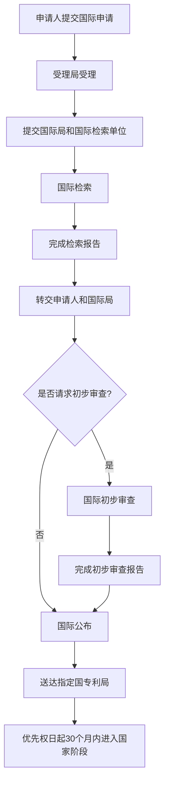

# 程序-原理-单一性与PCT申请

> **来源：** 崔国斌《专利法:原理与案例(第二版)》第7章 §1.4-1.5
> **核心法条：** 《专利法》第31条、第34条
> **关联页面：** [[程序-原理-申请文件]]、[[单一性-特定技术特征与特定领域判断|单一性-特定技术特征的认定]]、[[新颖性-原理-优先权|新颖性-优先权的认定]]

---

## 核心要点

专利申请的单一性要求一件申请应当限于一项发明,但属于一个总的发明构思的两项以上发明可以作为一件申请提出。PCT国际申请允许申请人通过一份申请向多个国家提出专利申请,简化了跨国申请程序。

---

## 1. 专利申请的单一性

### 基本规则

专利法要求,一件专利申请应当限于一项发明、实用新型或外观设计。此即专利申请的单一性要求。之所以设置这一要求,主要有两方面的原因:

1. **经济上**:为了防止申请人只支付一件专利的费用而获得几项不同发明或者实用新型专利的保护;

2. **技术上**:为了便于专利申请的分类、检索和审查。

为了避免单一性要求过于僵化,过分加重申请人的负担,专利法对单一性原则作出了变通性的规定:属于一个总的发明构思的两项以上的发明或者实用新型,同一产品两项以上的相似外观设计,或者用于同一类别并且成套出售或者使用的产品的两项以上外观设计,可以作为一件申请提出。

属于一个总的构思的发明的常见情形是产品、专用于制造该产品的方法、该产品的用途、实施特定方法的专门设备等发明之间互相组合的结果。

### 特定技术特征的认定

《专利法实施细则》第34条进一步规定,可以作为一件专利申请提出的属于一个总的发明构思的两项以上的发明或者实用新型,应当在技术上相互关联,包含一个或者多个相同或者相应的特定技术特征,其中特定技术特征是指每一项发明或者实用新型作为整体,对现有技术作出贡献的技术特征。

"特定技术特征是专门为评定专利申请单一性而提出的一个概念,应当把它理解为体现发明对现有技术作出贡献的技术特征,也就是使发明相对于现有技术具有新颖性和创造性的技术特征,并且应当从每一项要求保护的发明的整体上考虑后加以确定。"

如果两个独立权利要求之间不存在共同的体现发明新颖性或创造性的技术特征,则不存在所谓的单一性。

举例说明:假定一项申请含有三项权利要求,其中权利要求1由技术特征A和B组成,权利要求2由技术特征B和C组成,权利要求3由技术特征C和D组成。这时候,权利要求1、2和3之间,权利要求1和3之间,都不具备单一性,因为它们之间并不存在一项共同的技术特征。但是,权利要求1和2之间,或者,权利要求2和3之间,可能具有单一性,因为前者共享技术特征B,后者共享技术特征C。不过,如果B或者C特征并非体现发明新颖性或创造性的技术特征,则单一性也不存在。

### 分案申请

如果一项申请不符合单一性的要求,包含两项以上发明、实用新型或外观设计,申请人可以在办理专利授权登记手续的期限届满之前,申请分案。但是,专利申请已经被驳回、撤回或者视为撤回的,不能提出分案申请。"分案的申请不得改变原申请的类别。"分案申请可保留原申请日,但不得超出原申请记载的范围。

一项专利申请被授权之后,就不能再以不符合单一性为由宣告该专利无效。同样,即便专利的一项独立权利要求被宣告无效,导致剩下的从属权利要求之间不具备单一性,权利人也无须再弥补这一缺陷。

---

## 2. PCT国际申请

### PCT概述

《专利合作条约》(Patent Cooperation Treaty,PCT)于1970年6月19日在华盛顿签署,于1978年1月21日生效。经过1979、1984、2001等年份的多次修改,PCT逐步完善,程序逐步简便,受欢迎程度随之增加。中国于1994年1月1日加入PCT,国家知识产权局成为PCT的受理局、国际检索单位和国际初审单位。

PCT主要对国际专利申请的程序问题进行规范。依据该公约,任意缔约国的申请人可以按照公约规定的形式要件向公约确定的受理局提出国际申请,在国际申请中指定其希望获得专利权的国家(指定国)。这样,申请人就可以通过一份国际申请向多个国家提出专利申请要求。

### 国际申请的受理

受理局在收到国际申请后,按照PCT及其附属规则对国际申请的形式要件进行审查。比如,申请的资格、文件的格式、缴费情况等。该申请至少要选定一个指定国。受理局受理国际申请后,在一定的期限内,向世界知识产权组织(WIPO)的国际局和PCT确定的国际检索单位移送该国际申请的文本(其中向国际局移送的文本视为正式文本)。

### 国际检索

国际检索单位是特定几个国家的专利局和政府间组织的专利机构。它们是PCT大会在考虑到这些机构的人力、资料等因素后委任的。每一份国际申请都必须经过国际检索单位的国际检索。

国际检索的目的是检索与发明主题有关的在先技术。国际检索单位须在规定的时间里完成国际检索报告,并尽快转交给专利申请人和国际局。申请人在收到检索报告后,在规定的时间里拥有向国际局提出修改专利申请和权利要求的一次机会。当然,修改的范围不得超出国际申请先前所揭示的范围。

国际申请和国际检索报告按照PCT及其附属规则,送达申请中所指定的每一个国家的专利局(指定局)。

### 国际公布

国际局通常在国际申请的优先权日起满18个月后就对外公布该国际申请。申请人也可以在上述期限届满前请求国际局提前公开其专利申请。在指定国国内法律没有特殊规定的情况下,国际公布的效力与指定国国内未经审查的国内申请公布的效力是一致的。

### 国际初步审查

经申请人的请求并交纳规定的费用后,由公约确定的国际初步审查单位对国际申请进行国际初步审查,并在规定的时间里完成国际初步审查报告。国际初步审查的目的是结合国际检索报告中的文件材料,对发明的新颖性、创造性和实用性提出初步的意见。

此审查意见对指定局没有约束力。PCT第35条第2款甚至直接规定初步审查报告不应对国际申请在某一特定国家的专利性问题发表意见。PCT第27条第5款表述也很清楚,本条约的任何规定不得被解释为对成员国按照自己意志确定专利性的实质条件的自由进行任何限制。

在初步审查报告定稿之前,申请人可以和审查单位进行联系,并按照规定对权利要求等进行修改。国际初步审查报告将转交申请人和国际局,再由国际局送交每一指定局。

### 国家阶段

申请人应当在优先权日起届满30个月内,向每一指定局提供国际申请的文本(如果国际申请已经按照PCT第20条移送指定局,则不必要)和译文,并交付国家费用。指定局在前述30个月的期限届满前,不得自动处理和审查该国际申请书。但是,如果申请人单独提出申请,则指定局可以随时处理或审查该国际申请。

一般而言,申请人会在国际初步审查报告的基础上最后考虑在哪些国家启动国家阶段的专利申请程序。但这并非通例。启动国家申请程序后,申请人则依据各国的国内法申请专利。

### PCT的优势

PCT的最大获益者是申请人,一种语言的申请文本可以在多个国家被视为合法申请。同时,PCT将申请程序的期限大大延长,使得申请人有更长的时间来考虑是否在多个国家寻求专利保护,从而节省申请人早期的申请成本。申请人可以获得一份国际检索报告,基于该报告,申请人可以更好地了解自己发明所处的技术状态,并为下一步寻求合适的保护范围作准备。

各国的专利局也会从PCT程序中获益。过去各国专利局独自对国际申请进行检索,重复劳动可能耗费大量人力物力。PCT统一提供国际检索报告和初步审查报告,对专利性做初步的判断供各国专利局参考,可以在很大程度上消除重复劳动。对于那些检索能力有限的发展中国家而言,PCT的检索报告和初步审查报告的重要性就更明显了。

PCT国际申请在优先权日起满18个月后就由国际局以原始申请文本对外出版公开,并提供英文的摘要和检索报告。这样,最新的技术信息在申请早期就得以公开,而不是要等到专利授权以后才公开。国际社会获取最新技术信息的速度大大加快。这自然会减少国际研究机构之间的重复研究工作,加快科学技术进步。

---

## 判断流程

---

## 本页典型案例索引

本页主要阐述单一性原则和PCT国际申请程序,未涉及具体案例。相关案例参见其他章节。

| 案例编号 | 案件编号 | 主题 | 关联章节 |
|---------|---------|------|---------|
| (无) | (无) | 单一性原则 | 本页 [[单一性-特定技术特征与特定领域判断|单一性-特定技术特征的认定]] |
| (无) | (无) | PCT国际申请 | 本页 |
| (无) | (无) | 分案申请 | [[程序-原理-专利申请的修改|修改-基于分案或分离技术特征]] |
