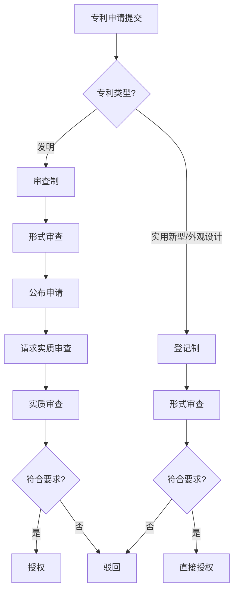

# 程序-原理-审查制与登记制

> **来源：** 崔国斌《专利法:原理与案例(第二版)》第7章 §3.1.1
> **核心法条：** 《专利法》第2条
> **关联页面：** [[程序-原理-初步审查]] [[程序-原理-实质审查]]

---

## 核心要点

专利授权机制主要有审查制和登记制两种。中国对发明专利实行审查制,对实用新型和外观设计实行登记制。审查制优点是专利权可靠性高、公众预期好,缺点是费时费力、资源耗费大;登记制优缺点正好相反。

---

## 1. 两种授权制度的对比

### 审查制

所谓审查制,是指专利局在授予专利权之前,对专利申请进行实质审查,确认申请的技术方案满足专利法的要求之后,才授予专利权。中国对发明专利申请实行审查制。

审查制的优点是经过这一程序产生的专利权的可靠性较大,权利人和社会公众能够在此之上建立合理的预期。缺点是这一程序费时费力,会实质性地延缓发明获得专利保护的时间,同时也耗费申请人和专利局的大量资源。对照发明专利商业化比例很低这一事实,审查制所造成的资源浪费就显得非常突出。

总体而言,审查制适用于那些可替代性较低、相对重要的发明专利申请。在这种情况下,社会对发明专利权利状态的确定性有较高要求,因而能够容忍相对较高的审查成本。

### 登记制

所谓登记制,是指专利局事先并不对专利申请进行实质审查,只要申请人提交了符合形式要求的专利申请,专利局就直接登记并授予专利权。中国对实用新型和外观设计就实行登记制。

登记制的优缺点正好与审查制相反。在登记制下,申请人和专利局无须花费过多的资源用于专利的事先审查。只有在实际交易或者纠纷出现之后,相关主体才会认真检索以确认该专利权权利状态。出现此类交易或纠纷的专利仅仅占实际专利申请的很小一部分。因此,登记制所节省的资源是非常可观的。

同时,登记制使得申请人能够在较短时间内就获得专利授权,从而及时获得保护。登记制节省成本,自然会有负面影响——专利权的效力极度不可靠,权利人和社会公众难易建立合理预期。

因此,登记制适合那些可替代性较大、数量较多而价值相对较小的专利申请。

---

## 判断流程

---

## 本页典型案例索引

本页主要阐述审查制与登记制的理论对比,未涉及具体案例。相关案例参见其他章节。

| 案例编号 | 案件编号 | 主题 | 关联章节 |
|---------|---------|------|---------|
| (无) | (无) | 审查制与登记制 | 本页 |
| (无) | (无) | 发明专利审查 | [[程序-原理-实质审查]] |
| (无) | (无) | 实用新型/外观设计授权 | [[程序-原理-初步审查]] |
