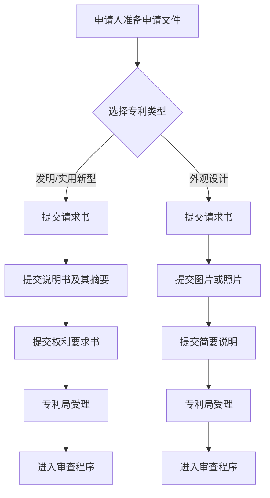

# 程序-原理-申请文件

> **来源：** 崔国斌《专利法:原理与案例(第二版)》第7章 §1.1
> **核心法条：** 《专利法》第26-27条
> **关联页面：** [[程序-原理-申请日与先申请原则]] [[程序-原理-专利申请的修改]]

---

## 核心要点

专利申请文件是专利权的载体,包括发明专利请求书、说明书及其摘要和权利要求书等。其中请求书记载程序性信息,说明书要求对发明作出清楚完整的说明以使所属领域技术人员能够实现,权利要求书则是界定专利保护范围的核心文件,由独立权利要求和从属权利要求组成。

---

## 1. 专利申请文件的构成

### 基本规则

一项发明要获得专利法的保护,必须首先由发明人(或其他受让人)向专利局提出专利申请。一份专利申请应当包含发明专利请求书、说明书及其摘要和权利要求书等文件。外观设计专利申请没有说明书和权利要求书,仅仅是专利请求书、外观设计的图片或者照片以及对该外观设计的简要说明等文件。

发明专利请求书记载特定专利申请的程序性信息,包括"发明或者实用新型的名称,发明人的姓名,申请人姓名或者名称、地址,以及其他事项"。

专利说明书则是描述发明具体内容的技术性文件。说明书的格式已经高度八股化,专利局要求它包含如下几部分内容:"技术领域、背景技术、发明内容、附图说明、具体实施方式。"发明人应该通过这一文件对发明"作出清楚、完整的说明,以所属技术领域的技术人员能够实现为准。"

权利要求书是申请人提交的界定专利保护范围的核心文件。权利要求书中通常包含数个乃至数十个权利要求。每一个权利要求实际上都是在描述一项受保护的技术方案。专利法将权利要求分成两类,独立权利要求与从属权利要求。

### 独立权利要求的撰写要求

所谓独立权利要求是指该权利要求没有引用其他权利要求,独自界定一项受保护的发明方案。对于独立权利要求,《专利法实施细则》(2010)第21条有明确的格式要求:

发明或者实用新型的独立权利要求应当包括前序部分和特征部分,按照下列规定撰写:

(一) 前序部分:写明要求保护的发明或者实用新型技术方案的主题名称和发明或者实用新型主题与最接近的现有技术共有的必要技术特征;

(二) 特征部分:使用"其特征是……"或者类似的用语,写明发明或者实用新型区别于最接近的现有技术的技术特征。这些特征和前序部分写明的特征合在一起,限定发明或者实用新型要求保护的范围。

发明或者实用新型的性质不适于用前款方式表达的,独立权利要求可以用其他方式撰写。

一项发明或者实用新型应当只有一个独立权利要求,并写在同一发明或者实用新型的从属权利要求之前。

### 从属权利要求的作用

从属权利要求则会引用其他权利要求(可能是独立权利要求,也可能是其他从属权利要求),在被引用权利要求的基础上,引入新的附加技术特征(限制性特征),缩小被引用权利要求的保护范围。

独立权利要求和从属权利要求的搭配,在专利法实践上有重要意义。独立权利要求所涵盖的限制性特征最少,它所界定的范围是一项专利可能获得保护的最大范围。而从属权利要求在独立权利要求的基础上引入新的限制性特征,它所界定的保护范围肯定要比独立权利要求小。如果独立权利要求能够通过审查获得授权,则其他从属权利要求在界定保护范围上就不再有意义。

不过,如果在专利无效诉讼过程中,独立权利要求不能经受考验,而被宣告无效。这时候,如果有从属权利要求,则权利人可以退而求其次,依据从属权利要求在更小的范围内主张权利。如果从属权利要求有很多层次,保护范围依次递减,则权利人可以步步为营,直到最后的也是保护范围最小的从属权利要求被无效,才算彻底失去专利权。

在专利获得授权后,在无效宣告程序中,专利局仅仅许可权利人以删除或合并权利要求、删除权利要求中技术方案等有限的方式修改权利要求(参见下文),权利人不能重新撰写权利要求,因此"独立权利要求加从属权利要求"保护范围逐级递减的权利要求书撰写策略显得更为重要。如果独立权利要求过宽,而从属权利要求过窄,在独立权利要求被宣告无效后,落入独立权利要求和从属权利要求中间地带的方案进入公共领域。

### 外观设计专利申请的特殊性

外观设计专利申请的文件构成与发明专利申请不同。外观设计专利申请没有说明书和权利要求书,仅仅是专利请求书、外观设计的图片或者照片以及对该外观设计的简要说明等文件。外观设计专利的保护范围主要根据该图片或者照片确定,必要时结合该简要文字说明。

这是因为外观设计的保护对象是产品的富有美感并适于工业应用的新设计,其保护范围的确定主要依赖于视觉观察,因此不需要像发明或实用新型那样通过文字描述技术方案。

---

## 判断流程

---

## 本页典型案例索引

本页主要阐述专利申请文件的基本构成和撰写要求,未涉及具体案例。相关案例参见其他章节。

| 案例编号 | 案件编号 | 主题 | 关联章节 |
|---------|---------|------|---------|
| (无) | (无) | 申请文件构成 | 本页 |
| (无) | (无) | 权利要求撰写 | [[权利要求-保护范围的确定]] |
