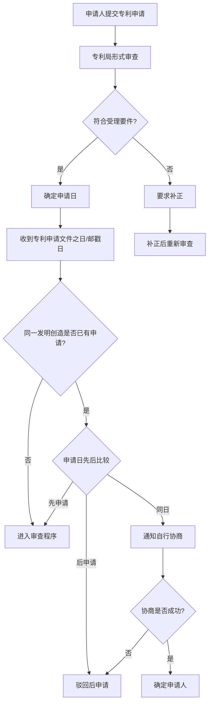

# 程序-原理-申请日与先申请原则

> **来源：** 崔国斌《专利法:原理与案例(第二版)》第7章 §1.2-1.3
> **核心法条：** 《专利法》第9条、第10条、第28条
> **关联页面：** [[程序-原理-申请文件]]、[[程序-原理-单一性与PCT申请]]、[[现有技术和现有设计-审查基准与为公众所知|现有技术-为公众所知的概念]]

---

## 核心要点

申请日是划定现有技术范围的时间界限,在确定权利归属、保护期限等方面具有关键作用。中国采用先申请原则,同样发明创造只能授予一项专利权,专利权授予最先申请的人,同一日申请的应当自行协商确定申请人。

---

## 1. 申请日的确定

### 基本规则

发明专利的申请人在准备好申请文件之后,可以通过多种途径向专利局递交专利申请。如果专利局经过形式审查,认为专利申请符合专利局所规定的受理要件,则会依据受理程序给定申请日和申请号。《专利法》(2008)第28条规定,"国务院专利行政部门收到专利申请文件之日为申请日。如果申请文件是邮寄的,以寄出的邮戳日为申请日。"当然,专利申请必须符合专利局所规定的受理要件,专利局才会依据受理程序给定申请日。

申请日在专利法上有重要意义。它是划定现有技术范围的时间界限,在确定权利归属、权利保护期限等方面也至关重要。

### 专利申请权的含义

申请人提出专利申请后,就对该申请享有所谓的专利申请权。《专利法》多处条文提及专利申请权,但没有明确定义。结合条文语境,大致可以将其理解为申请人对已经提出的专利申请的处置权,这与技术成果的所有人就该技术"申请专利的权利"是不同的概念。《专利法》第10条规定,专利申请权可以转让,并规定转让时应当通过专利局进行登记和公告。

---

## 2. 先申请原则

### 基本规则

依据中国《专利法》,同样的发明创造只能授予一项专利权。"两个以上的申请人分别就同样的发明创造申请专利的,专利权授予最先申请的人。"此即所谓的先申请原则。如果两个以上的申请人在同一日提出相同的申请,则"应当在收到国务院专利行政部门的通知后自行协商确定申请人"。

逾期没有答复的,视为撤回。如果协商不成,则会驳回专利申请。

### 先申请原则的优缺点

先申请原则有很多优点:

1. **降低制度成本**:按照申请先后确定权属,避免对发明过程进行调查,比较容易操作,可以有效降低确定权属的制度成本;

2. **促进公开**:可以促使申请人尽快公开其发明,减少重复研发的成本;

3. **社会效益**:让社会更早地从中获得好处(实际利用该发明或者从中获得有益启发)。

不过,先申请原则也可能导致率先作出发明的人却因申请动作较慢而得不到专利权,因此有失公平。一般认为先申请原则对于大企业比较有利,因为它们有足够的人力物力来及时处理专利申请事宜。小企业或个人在这一方面劣势明显,可能会发明在先但准备申请在后,从而失去专利法的保护。

### 与先发明原则的对比

相对先申请原则而言,先发明原则直觉上显得更公平一些。发明人在最先作出发明后可以比较从容地准备专利申请,而不担心别人赶在自己前面申请专利。但是,在这一制度下,确认专利权的归属常常变得非常复杂,导致很多无谓的诉讼。因此,即便在过去接受先发明原则的美国,对于在先发明人公开使用发明后申请专利也有一定的时间限制(宽限期)。

美国从2013年3月16日开始(AIA法案生效日)已经正式放弃独一无二的先发明原则,采用所谓的发明人先申请制(first-inventor-to-file),在发明人之间按照申请先后来确定专利权归属。虽然一些具体的配套规则(比如宽限期、优先权、公开的标准等)与中国法不尽相同,但整体原则与中国的先申请原则已经相当接近。

中国过去的《保障发明权与专利权暂行条例施行细则》(1950)第15条有如下规定:"二人以上有同一的发明,以申请的先后,决定其优先权;但为使发明者都得到应有的鼓励,得裁定前项发明权或专利权为共有,给予优先者以较大的比例。"这已经是一项过时的规定。不过,从中可以看出,当时中国决策者在先申请与先发明原则之间犹疑的矛盾心态。

---

## 判断流程

---

## 本页典型案例索引

本页主要阐述申请日确定和先申请原则的理论基础,未涉及具体案例。相关案例参见其他章节。

| 案例编号 | 案件编号 | 主题 | 关联章节 |
|---------|---------|------|---------|
| (无) | (无) | 申请日确定 | 本页 |
| (无) | (无) | 先申请原则 | 本页 |
| (无) | (无) | 优先权 | [[新颖性-原理-相同或实质相同|新颖性-相同主题的判断]] |
