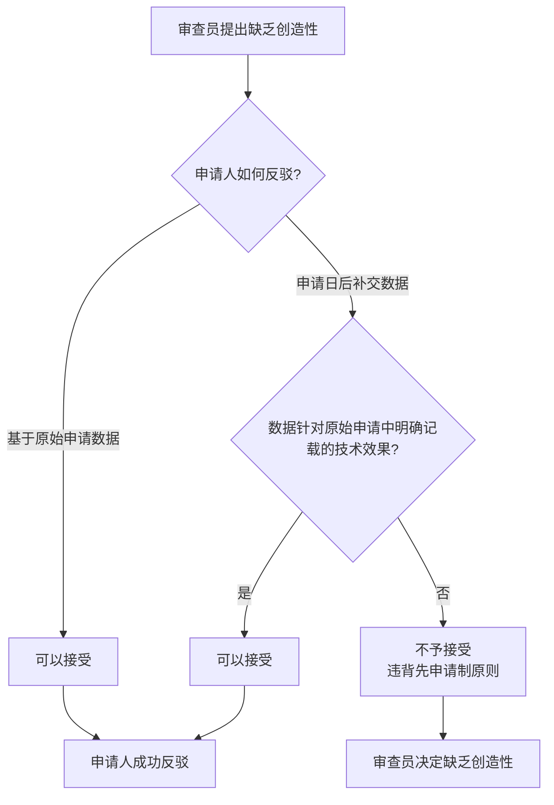

# 说明-原理-创造性与充分公开的区别

> **来源:** 《专利法:原理与案例(第二版)》第6章 §3.4,页571-611
> **核心法条:** 《专利法》第26条第3款、第22条第3款
> **关联页面:** [[说明-原理-书面描述与能够实现的关系]]
> **比较法内容：** 本页包含比较法分析，供参考。以中国《专利法》及审查实践为准。

---

## 核心要点

充分公开通常是指要公开"发明是什么""如何制造和使用发明"等内容,而发明的创造性审查则是将权利要求所覆盖的技术方案与现有技术进行比较;在审查程序中,审查员需要证明权利要求的技术方案同现有技术相比不具备创造性,而申请人在原始申请中提供的数据有缺陷时,通常不能通过提交申请日后补交的实验数据来证明发明具有创造性。

---

## 1. 两个要求的不同

### 充分公开的要求

充分公开通常是指要公开"发明是什么""如何制造和使用发明"等内容。《专利审查指南》(2010)第二部分第十章第3.4节278页:"判断说明书是否充分公开,以原说明书和权利要求书记载的内容为准,申请日之后补交的实施例和实验数据不予考虑。"

先前《专利审查指南》(2001年)第二部分第十章第4.3节"关于实施例"第(2)项规定则更有弹性:

"不能允许申请人将申请日之后补交的实施例写入说明书,尤其是其中与保护范围有关的内容,更不允许写进权利要求。后补交的实施例只能供审查员审查新颖性、创造性和实用性时参考。"

### 创造性的审查

充分公开与发明的创造性审查似乎没有直接的关系。从专利审查程序中的举证责任分配的角度看,审查员需要证明,专利权利要求中的技术方案同现有技术相比,不具备创造性。通常,审查员会援引在先文献来证明不具备创造性。这时,申请人在不修改说明书和权利要求的情况下,可以举证对审查员的意见进行反驳。举证自然包括提交新试验数据。

---

## 2. 选择性发明的创造性证明

### 数据缺陷的问题

如果一个发明为选择性发明,申请人在提交申请时,已经披露了最接近的在先文献,则申请人通常需要在申请中提交数据说明其选择发明具有意想不到的效果,否则审查员将推定该发明不具备创造性。

如果申请人在原始申请中提供的数据有缺陷,没有能够证明该发明有意想不到的效果,在面对审查员的驳回威胁时,申请人是否还能补交数据证明发明具有意想不到的效果,从而具有创造性吗?

### 最高法院的立场

最高人民法院在下面的"武田药品"(II)案、日本斯倍利亚社股份有限公司v.专利复审委员会（现专利复审和无效审理部）(最高人民法院(2014)知行字第84号)、北京亚东生物制药有限公司v.专利复审委员会（现专利复审和无效审理部）(最高人民法院(2013)知行字第77号)等案中,均拒绝接受申请人在申请人以后提交的证明发明创造性的证据。

---

## 3. 经典案例分析

### 武田药品工业株式会社v.专利复审委员会（现专利复审和无效审理部）(II)

- **审理法院:** 最高人民法院
- **案号:** (2012)知行字第41号
- **争议焦点:** 申请日后补交的实验数据能否用于证明发明具有创造性
- **技术背景:** 本案涉及专利名称为"用于治疗糖尿病的药物组合物"的发明专利。专利号为96111063.5,专利权人为武田药品工业株式会社。本专利授权公告的权利要求为:"1. 用于预防或治疗糖尿病、糖尿病综合症、糖代谢紊乱或脂质代射紊乱的药物组合物,其含有选自吡格列酮或其药理学可接受的盐的胰岛素敏感性增强剂,和作为胰岛素分泌增强剂的磺酰脲。"
- **决定要点:**
  1. 专利申请人在申请专利时提交的专利说明书中公开的技术内容,是国务院专利行政部门审查专利的基础和申请人对申请文件进行修改的依据,亦是社会公众了解、传播和利用专利技术的基础。说明书应当满足充分公开发明或者实用新型的要求。化学领域属于实验性科学领域,影响发明结果的因素是多方面、相互交叉且错综复杂的。说明书的撰写应该达到所属技术领域的技术人员能够实施发明的程度。
  2. 根据现有技术,本领域技术人员无法预测请求保护的技术方案能够实现所述用途、技术效果时,说明书应当清楚、完整地记载相应的实验数据,以使所属技术领域的技术人员能够实现该技术方案,解决其技术问题,并且产生预期的技术效果。凡是所属领域的技术人员不能从现有技术中直接、唯一地得出的有关内容,均应当在说明书中予以表述。如果所属领域的技术人员根据现有技术不能预期该技术方案所声称的治疗效果时,说明书还应当给出足以证明所述技术方案能够产生所声称效果的实验数据。
  3. 没有在专利说明书中公开的技术方案、技术效果等,一般不得作为评价专利权是否符合法定授权确权标准的依据。申请日后补交的实验数据不属于专利原始申请文件记载和公开的内容,公众看不到这些信息,如果这些实验数据也不是本申请的现有技术内容,在专利申请日之前并不能被所属领域技术人员所获知,则以这些实验数据为依据认定技术方案能够达到所述技术效果,有违专利先申请制原则,也背离专利权以公开换保护的制度本质,在此基础上对申请授予专利权对于公众来说是不公平的。
  4. 当专利申请人或专利权人欲通过提交对比试验数据证明其要求保护的技术方案相对于现有技术具备创造性时,接受该数据的前提必须是针对在原申请文件中明确记载的技术效果。
  5. 武田药品工业株式会社提供反证7欲证明吡格列酮与格列美脲的联合用药方案相对于单独用药方案以及其他联合用药方案均取得了意料不到的降血糖效果。但是,本专利说明书仅通过吡格列酮与伏格列波糖联用以及吡格列酮与优降糖联用的实验结果,证明胰岛素敏感性增强剂与胰岛素分泌增强剂联用相对于其中一类药物单独用药有更好的降血糖效果,并没有提及各种不同的药物联用方案之间效果的优劣。
  6. 武田药品工业株式会社提供实验数据所要证明的技术效果是原始申请文件中未记载,也未证实的,不能以这样的实验数据作为评价专利创造性的依据。
- **启示:** 申请日后补交的实验数据不得作为评价专利创造性的依据,除非该数据是针对原申请文件中明确记载的技术效果。

---

## 4. 举证责任分配

### 举证责任在申请人

一件专利申请能够得到授权,该专利申请的申请人应当首先向专利权的相对人即社会公众清楚、有说服力地表明其权利要求的保护范围是以说明书为依据,能够得到说明书的支持。如果专利申请的说明书中不能提供相应的证据证明其权利要求能够得到说明书的支持,那么就不应当把举证责任不合理地倒置给社会公众。

### 创造性审查的举证责任

在创造性审查中,审查员需要证明权利要求的技术方案同现有技术相比不具备创造性。通常,审查员会援引在先文献来证明不具备创造性。这时,申请人在不修改说明书和权利要求的情况下,可以举证对审查员的意见进行反驳,但举证仅限于对审查员所引用的现有技术或论点进行反驳,而不能通过提交新的实验数据来证明发明具有意想不到的效果,除非该效果在原始申请文件中已经明确记载。

---

## 5. 争议与平衡

### 专利法是否过于严厉

专利法如果要求专利申请人必须在原始申请文件中以书面形式证明自己的发明相对所有现有技术(无论发明人是否掌握)有创造性,对于专利申请人而言可能过于严厉。申请人在提交申请时,不可能穷尽所有的在先文献,因而无法针对性地提供数据说明自己的发明方案相对所有的现有技术一定具有创造性。专利法禁止申请人事后补充数据证明创造性,实际上是在惩罚那些没有能够检索到在先文献的申请人。

### 理论上可以防止隐瞒

理论上,这可以防止申请人隐瞒部分对其发明创造性构成威胁的文献。不过,中国专利法的立法者显然不认为申请人刻意隐瞒在先文献对于公共利益有重大损害,否则早就应该在专利法中明确要求申请人披露他所知道的所有在先文献。

### 选择性发明的制度漏洞

但是,如果轻易许可申请人事后补交证明创造性的证据,则对于那些基于现有技术的"选择发明"而言,可能出现制度漏洞:发明人在未知自己的技术方案相对在先发明有哪些突出特点的情况下,就可以先提交申请,然后再找证据证明自己的选择性发明具有创造性。

### 两害相权

两害相权,本书依然倾向于认为,专利法应区别对待传统意义上的充分公开要求和"创造性的证明要求"。在后一问题上,专利法应该对专利申请人或权利人相对宽容。毕竟,发明人成功利用权利要求先画圈,再证明其有创造性的机会似乎微乎其微。

---

## 6. 美国法的对比

### 美国《专利法》第112条

美国《专利法》第112条规定,说明书应当包含一份书面[说明],描述该发明、制造和使用它的方式和方法,要使用完整、清楚、简洁和准确的术语,以至于与之相关的或最接近领域的任何熟练技术人员能够制造和使用该发明,同时应说明发明人在发明过程中所掌握的最佳实施例。

### 书面描述与能够实现的独立要求

美国联邦巡回上诉法院在Ariad案中确认,第112条第1款包含有两个独立的描述要求:(i)关于发明的书面描述,和(ii)关于制造和使用发明的方式和方法的书面描述。这说明在美国法上,书面描述和能够实现是两个独立的要求。

### 创造性的举证责任

在美国专利审查实践中,审查员需要证明权利要求相对于现有技术是显而易见的(obvious)。申请人可以通过提交实验数据来证明发明具有非显而易见性(non-obviousness),但这些数据必须在申请时已经披露,或者针对的是审查员所引用的现有技术,而不是针对申请人未知的所有现有技术。

---

## 7. 判断流程

---

## 本页典型案例索引

| 决定编号 | 案件编号 | 主题 | 关联章节 |
|---------|---------|------|---------|
| (2012)知行字第41号 | 武田药品v.专利复审委员会（现专利复审和无效审理部）(II) | 申请日后补交数据证明创造性 | - |
