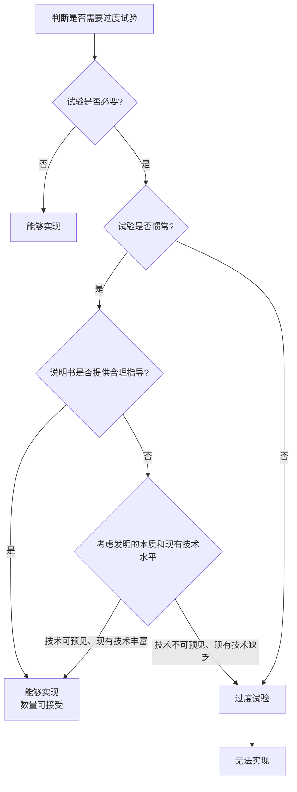

# 说明-原理-无需过度实验标准

> **来源:** 《专利法:原理与案例(第二版)》第6章 §2.1,页37-109
> **核心法条:** 《专利法》第26条第3款
> **关联页面:** [[说明-原理-能够实现的概述]]、[[说明-原理-技术方案概括]]
> **比较法内容：** 本页包含比较法分析，供参考。以中国《专利法》及审查实践为准。

---

## 核心要点

"无须过度实验"标准认为,只要熟练技术人员无须付出创造性劳动就能够实施一项技术方案,则该技术方案被视为"能够实现";即使需要经过简单试验以确定具体的实施方法,也会被认为"能够实现",但试验必须是惯常的而非过度的。

---

## 1. 中国司法实践标准

### "无须创造性劳动"

在司法实践中,只要熟练技术人员**无须付出创造性劳动**就能够实施一项技术方案,则该技术方案被视为"能够实现"。换句话说,即使熟练技术人员在直接实施技术方案前,还需要经过简单的试验以确定具体的实施方法,法院也会认为该方案"能够实现"。

### 案例:陕西金枝科工贸有限公司v.国家知识产权局专利复审委员会（现专利复审和无效审理部）

- **审理法院:** 北京市高级人民法院((2003)高行终字第156号)
- **争议焦点:** 专利说明书中未对齿轮系的结构和组合进行具体描述,是否导致无法实现
- **决定要点:** 本案专利说明书中虽然未对齿轮系的结构和组合进行具体的描述,但是齿轮系的结构是机械领域的常识技术,齿轮组的数量可以根据传动比等方面的要求而具体设定。关于"齿轮系的最后一个齿轮与微动开关相连"这一特征,根据本领域的常识技术可知,仅靠微动开关和齿轮相连,微动开关的状态不会发生任何改变,无法进行信号传输,因此在微动开关和齿轮之间必然存在一个推动机构。该推动机构的具体形式、与相连部件的配合关系都是本领域的普通技术人员根据实际需求通过计算和实验即可决定的。
- **启示:** 本领域技术人员可以基于常识技术识别并补充专利文件中的"明显错误",不会因此导致技术方案无法实现。

---

## 2. 美国专利法的"无须过度试验"标准

### 核心原则

在美国专利法上,充分公开的核心标准是权利要求所覆盖的技术方案本身在熟练技术人员看来无须经过过度试验(undue experimentation)就可实现。

### 案例:In re Wands,858 F.2d 731,737(1988)

- **审理法院:** 美国联邦巡回上诉法院
- **争议焦点:** 如何判断何谓"过度试验"
- **决定要点:**
  1. 必须进行一些试验,比如惯常的筛选,并不否定"能够实现"的认定。但是,实施发明所需要的试验必须不是过度的试验。这里的关键词是"过度",而不是"试验"。
  2. 在一个给定的案件中,判断何谓过度试验,需要采用理性标准,考虑发明的本质和现有技术水平。这一测试并非仅仅是量上的判断,如果试验仅仅是惯常的,或诉争的说明书对于试验进行的方向提供了合理的指导意见,则相当数量的试验都是许可的。
  3. "过度试验"一词并没有出现在法律条文中,但是可靠的是,"能够实现"要求说明书应当教导技术人员无须过度试验就能够制造和使用该发明。是否需要过度试验,并非一个孤立而简单的事实判断,而是要权衡很多事实因素才能得出结论。
- **启示:** "过度"与"试验"的区别是关键,即使需要大量试验,如果是惯常的或有明确指导的,也是可以接受的。

---

## 3. 判断"过度试验"的考虑因素

### In re Forman案中的要素

在In re Forman案中,专利上诉与争议委员会(the board)归纳了判断一项披露是否需要过度试验时需要考虑的因素。它们包括:

1. 所需要的试验的数量;
2. 需要的提示和指导的量;
3. 实施例的有或无;
4. 发明的性质;
5. 在先技术的状况;
6. 该领域技术人员的相对技能;
7. 该技术的可预见性或不可预见性;以及
8. 权利要求的宽度。

---

## 4. 中美标准的比较

### 中国:"无须创造性劳动"

中国专利审查实践中,审查员对于所谓"无须创造性劳动"和"无须过度实验"的理解,可能并无明显差异。在伊莱利利案中,复审委就有明确的表述。

### 美国:"无须过度实验"

本书倾向于认为,"无须过度实验"的表述优于"无须创造性劳动"。如果一项发明要经过惯常而且繁重的实验才能验证其是否可行,尽管该验证无需智力上的"创造性",社会公众通常会对验证过程望而却步,因而并不能轻易了解该发明究竟是否可行。因此,专利法如果采用后一标准理论上可能会导致审查员容忍惯常但繁重的实验,从而接受过于宽泛的权利要求。

---

## 5. 经典案例分析

### 白炽灯专利案(The Incandescent Lamp Patent)

- **审理法院:** 美国最高法院
- **案号:** 159 U.S. 465(1895)
- **争议焦点:** Sawyer和Man的权利要求是否过于宽泛,是否满足充分公开要求
- **决定要点:**
  1. 如果专利权人发现了全部纤维或织物材料所共同具有的一项特点,或者它们区别于其他材料(比如矿物质等)的共同特点,而该特点使得它们特别适宜制作白炽灯丝导体,则该权利要求或许并不宽泛。
  2. 但是,如果木头通常并不适合该目的,但是专利权人还是发现一种木头具有某种特点,该特点使得该木头特别适合该目的,则他人在发现一种不同的木头具有类似或更优的特点后,利用该木头实现前述目的的行为,并不构成侵权。
  3. 本案中,Sawyer和Man发现炭化纸是制作白炽灯丝导体的最佳材料,但他们撰写了一个很宽的权利要求,涵盖每一种纤维或织物材料。Edison对超过6千种植物的检测表明,没有一种具有适合上述目的的特点。Edison花费数月试验后发现适宜的材料大约只有三种竹子、一种甘蔗以及一到两种源自龙舌兰类植物的纤维。
  4. 法院认为,在看到Edison先生和他的助手们为确定最适宜制作白炽灯丝导体的材料所做的长达数月的试验之后,许可上述权利要求所导致的不公就变得很明显。这一宽泛的权利要求会阻碍每一个人进行进一步的调查。
- **启示:** 对于材料类发明,仅公开一种或少数几种具体材料,却主张对整个材料类别的垄断权,是不符合充分公开要求的。

---

### 伊莱利利公司v.专利复审委员会（现专利复审和无效审理部）

- **审理法院:** 北京市高级人民法院((2008)高行终字第451号)
- **争议焦点:** 马库什权利要求中部分实施例无法达到发明目的,是否符合专利法第26条第4款的规定
- **决定要点:**
  1. 本专利权利要求1要求保护的是"制备β异头物富集的核苷的方法"。本专利说明书公开了58个实施例和3个表格例共计104个实施例数据,其中11个实施例不能达到制得β异头物富集的核苷的发明目的或发明效果。
  2. 由于说明书中公开的部分实施例或实施方式不能达到发明目的或发明效果却又被概括纳入权利要求书的保护范围,并且删除该部分实施例或实施方式时权利要求的保护范围相应缩小,则应当认为该权利要求得不到说明书的支持。
  3. 权利要求允许概括的范围是本领域技术人员能够"合理预测"或者按照"常规试验容易确定"的范围。当超出此种"合理预测"或者"常规试验容易确定"的范围,即需要大量反复试验或者过度劳动才能实现的技术方案时,应当认为该权利要求没有得到说明书的支持。
- **启示:** 马库什权利要求所涵盖的技术方案中,如果有部分无法实现且需要大量试验才能筛选,则该权利要求得不到说明书的支持。

---

## 6. 判断流程

---

## 本页典型案例索引

| 决定编号 | 案件编号 | 主题 | 关联章节 |
|---------|---------|------|---------|
| (2003)高行终字第156号 | 陕西金枝案 | 齿轮系结构无需详细描述 | - |
| In re Wands | 858 F.2d 731(1988) | 过度试验的判断标准 | - |
| 白炽灯专利案 | 159 U.S. 465(1895) | 材料类别权利要求过宽 | [[说明-原理-生物领域宽泛权利要求]] |
| (2008)高行终字第451号 | 伊莱利利公司v.专利复审委员会（现专利复审和无效审理部） | 马库什权利要求的支持 | [[说明-原理-书面描述概述]] |
