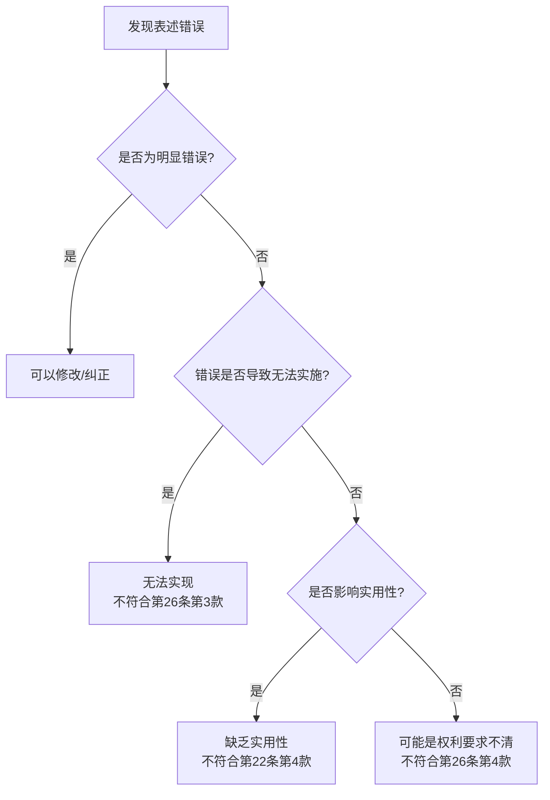

# 说明-原理-表述错误导致不可实现

> **来源:** 《专利法:原理与案例(第二版)》第6章 §2.5-2.6,页278-289
> **核心法条:** 《专利法》第26条第3款、第22条第4款
> **关联页面:** [[说明-原理-能够实现的概述]]、[[说明-原理-表述错误导致不支持]]
> **比较法内容:** 本页包含美国《专利法》第112条和In re Gardner案例分析，供比较法参考。以中国《专利法》及审查实践为准。

---

## 核心要点

如果说明书或权利要求中存在"明显错误"导致权利要求的技术方案不可实现,申请人可以修改说明书或权利要求以消除这一缺陷;但并非所有表述错误都容易认定为"明显错误",有些错误可能导致技术方案无法实施从而无法实现,有些则可能被认定为实用性问题。

---

## 1. 表述错误的处理原则

### 修改的可能性

如果说明书或权利要求中存在"明显错误"导致权利要求的技术方案不可实现,申请人可以修改说明书或权利要求以消除这一缺陷。这在前文关于"修改超范围"一节已有讨论。依据现行《审查指南》,甚至审查员可以自行依职权修改此类明显错误。

### 明确错误的标准

不过,有时候说明书比较模糊,难以认定是文字错误。在刘玉宏v.专利复审委员会（现专利复审和无效审理部）((2005)一中行初字第542号)案中,关于专利权利要求是否存在笔误,法院有如下意见:

根据《审查指南》的相关规定,能够称为笔误的应属于"明显错误",是指不正确的内容可以从原说明书、权利要求书的上下文中清楚地判断出来,没有作其他解释或者修改的可能。

---

## 2. 经典案例分析

### 刘玉宏v.专利复审委员会（现专利复审和无效审理部）

- **审理法院:** 北京市第一中级人民法院
- **案号:** (2005)一中行初字第542号
- **争议焦点:** 权利要求书和说明书记载的"显示与操作区"表述矛盾,是否构成明显错误
- **决定要点:**
  1. 本案中,本专利授权公告的说明书存在两种截然相反的记载,即在权利要求书及具体实施方式部分记载"设置显示与操作不面向服务区的自动存款机",而在发明内容及摘要部分又记载"设置显示与操作窗口面向服务区的自动存取款机"。
  2. 此外,原告在无效程序及诉讼程序中,对此问题亦曾作出过两种完全不同的意思表示,即在口头审理前的意见陈述中明确表示"显示与操作区不一定非要面向客户",而在口头审理和本案诉讼过程中又表示"显示与操作不面向服务区"为笔误。
  3. 由于说明书和权利要求书中均没有记载过"显示与操作部"这一技术名词,从上述记载和意思表示中也无法清楚地、毫无疑义地判断出哪一种表述是正确的。
  4. 因此,不能将"显示与操作不面向服务区"唯一地解释为"显示与操作部面向服务区"。原告关于权利要求1中存在笔误的主张不能成立,法院不予支持。
- **启示:** 明显错误必须能够从上下文中"清楚地、毫无疑义地"判断出来,如果存在多种解释或意思表示不一致,则不能认定为明显错误。

---

## 3. "能够实现"与"实用性"的区别

### 重叠的可能性

证明一个方案具有实用性或创造性,与一个方案是否可以由普通技术人员实施,是两个不同的问题,但又有关联性。比如,合成一种新的化合物,没有解释其用途,就可能被认为不具备实用性,也可能被视为没有充分公开其用途,因而不符合"能够实现"的要求。

### 美国法的经验

美国《专利法》第112条关于"能够实现"(enablement)的要求中,包含揭示如何使用(How to Use)的要求。因此,美国也存在"能够实现"要求与实用性要求重叠的可能。

#### 案例:In re Gardner,Roe,and Willey,427 F.2d 786(1970)

- **审理法院:** 美国关税与专利上诉法院
- **案号:** 427 F.2d 786(1970)
- **技术背景:** 发明人揭示了一种具有抗抑郁效果的药物及利用此类药物治疗抑郁症的方法。
- **争议焦点:** 模糊的剂量范围是否满足充分公开要求
- **决定要点:**
  1. 发明人只是模糊地揭示了剂量范围("about 10 mg. to about 450 mg."),法院认为普通技术人员不通过复杂试验,无法知道合理的使用方案。
  2. 法院最终认为这一揭示无法满足美国《专利法》第112条"能够实现"要求,宣告所有的权利要求无效。
- **启示:** 对于化学医药领域,模糊的剂量范围导致无法确定合理使用方案,不符合"能够实现"要求。

---

## 4. 美国学者的观点

### "无法实施"必然缺乏实用性

美国学者甚至认为,如果专利缺乏实用性(utility),则必然不能满足所谓"能够实现"(enabled)的要求,因为熟练技术人员根本就不能实施该发明。

### "能够实现"是否要求实用性验证

如我们所知,对于熟练技术人员而言,如果依据专利说明书无需复杂试验就能实现权利要求所述发明,则就满足了"能够实现"要求。对于实用性,是否也可以说:即便发明人自己在申请时并未提交证据证明该发明具有其所宣称的实用性,只要验证该实用性的试验不够复杂,实用性的要求就得到满足?

这是一个值得深入思考的问题。实际上,这涉及到"能够实现"和"实用性"两个要求的关系和界限:

1. **侧重点不同:** "能够实现"强调的是技术人员能否实施发明的技术方案;"实用性"强调的是发明是否具有实际应用价值。
2. **证明要求不同:** "能够实现"通常要求说明书提供足够的技术教导,使技术人员能够实施;"实用性"通常要求发明能够产生积极效果,在工业上能够制造或使用。
3. **测试重点不同:** "能够实现"测试的是技术方案的可行性;"实用性"测试的是技术方案的有用性。
4. **重叠可能性:** 有些情况下,无法实施的技术方案必然不具有实用性;但有些技术方案能够实施,却不具有实用性(如永动机)。

---

## 5. 判断流程

---

## 6. 思考问题

### 区分"能够实现"与"书面描述"的不同要求

如何区分"书面描述"与"能够实现"两项不同的要求?在本案中,如何区分?

**分析:** 这涉及到专利法充分公开要求的两个方面:

1. **"能够实现"(Enablement):** 要求说明书提供足够的技术教导,使所属技术领域的技术人员能够实施发明。关注的是技术上的可行性。
2. **"书面描述"(Written Description):** 要求说明书证明发明人在申请时已经完成了(即"实际掌握"了)所主张的发明。关注的是发明人对发明的实际掌握程度。

在有些情况下,技术方案可能能够实现,但发明人并未实际完成(比如基于理论推测),此时就不满足"书面描述"要求。反之,在有些情况下,发明人已经完成了发明,但说明书未能充分披露如何实施,此时就不满足"能够实现"要求。

---

## 本页典型案例索引

| 决定编号 | 案件编号 | 主题 | 关联章节 |
|---------|---------|------|---------|
| (2005)一中行初字第542号 | 刘玉宏v.专利复审委员会（现专利复审和无效审理部） | 明确错误的认定标准 | - |
| 427 F.2d 786(1970) | In re Gardner | 剂量范围模糊导致无法实现 | - |
