# YunPat 架构文档（自动生成）

**生成时间**: 2026-05-04T16:28:52.295Z
**包数量**: 12
**Agent 数量**: 27

## 📦 包概览

| 包名                            | 描述                                                                |
| ------------------------------- | ------------------------------------------------------------------- |
| @yunpat/builtin-tools           | YunPat 内置工具集 - 文件操作、搜索、网络请求等常用工具              |
| @yunpat/cli                     | YunPat CLI - 命令行工具                                             |
| @yunpat/core                    | YunPat 核心框架 - 智能体抽象、事件总线、生命周期管理                |
| @yunpat/document-tools          | YunPat 文档解析工具集 - 支持 PDF、DOCX、Excel、图片、音频等多种格式 |
| @yunpat/grpc-server             | YunPat gRPC Server - TypeScript 实现                                |
| @yunpat/image-tools             | YunPat 图像识别工具集 - 化学结构、数学公式识别                      |
| @yunpat/orchestrator            | YunPat Orchestrator Agent - 中枢层智能调度系统                      |
| @yunpat/patent-core             | 专利核心算法桥接 - Rust CLI 调用与 TypeScript 降级                  |
| @yunpat/patent-knowledge        | 专利知识库桥接 - Obsidian知识库集成                                 |
| @yunpat/patent-prompts          | 专利提示词模板管理器 - 支持分步加载和缓存                           |
| @yunpat/patent-tools            | YunPat 专利工具集 - 权利要求生成、质量评估、审查答复等              |
| @yunpat/unified-knowledge-graph | 统一知识图谱服务 - 整合 OpenClaw、YunPat、Athena 三方专利知识图谱   |

## 🤖 Agents 概览

### 内容生成 (11个)

- **abstract-drafter**: 专利摘要撰写智能体 - 撰写专利摘要
- **analysis**: 专利分析智能体 - 现有技术深度分析、对比分析、交底书再分析
- **claim-generator**: 权利要求生成智能体 - 基于发明理解和检索分析撰写权利要求
- **comparison-report-generator**: 对比报告生成Agent - 生成专利申请与现有技术的对比分析报告
- **invention**: 发明理解智能体 - 专利交底书分析与结构化理解
- **patent-analyzer**: 专利分析智能体 - 专利文献深度分析
- **patent-responder**: 专利答复智能体 - OA 审查意见答复与策略生成
- **patent-writer**: 专利撰写智能体 - 集成知识库和分步加载提示词模板
- **researcher**: 研究分析师智能体 - 信息搜集、数据整理、报告生成
- **specification-drafter**: 说明书撰写智能体 - 分章节撰写专利说明书
- **writer**: 专利撰写智能体 - 集成知识库和分步加载提示词模板

### 基础 (3个)

- **base**: YunPat 专业层Agent基类 - 统一的Agent架构
- **integration-tests**: 无描述
- **test**: 工作流测试 - 验证专利申请工作流

### 检查验证 (7个)

- **claims**: 权利要求生成智能体 - 专利权利要求书撰写
- **claims-formality-checker**: 无描述
- **quality**: 专利质量检查智能体 - 权利要求/说明书/术语一致性检查
- **quality-checker**: 质量检查Agent - 评估专利申请质量
- **spec-formality-checker**: 无描述
- **subject-matter-checker**: 无描述
- **unity-checker**: 无描述

### 技术工具 (3个)

- **format-converter**: 专利格式转换智能体 - Markdown/结构化内容转DOCX
- **specification**: 说明书撰写智能体 - 专利说明书分章节撰写
- **technical-drawing**: 技术图纸识别智能体 - 支持化学结构、数学公式、OCR

### 检索管理 (3个)

- **patent-manager**: 专利管理智能体 - 专利全生命周期管理与监控
- **prior-art-search**: 先导技术检索智能体 - 构建检索策略并分析现有技术
- **search**: 专利检索智能体 - 检索策略生成与执行

## 🔗 依赖关系

```mermaid
graph TD
    builtin-tools --> core
    cli --> agent-abstract-drafter
    cli --> agent-analysis
    cli --> agent-claim-generator
    cli --> agent-claims
    cli --> agent-invention
    cli --> agent-patent-analyzer
    cli --> agent-patent-manager
    cli --> agent-patent-responder
    cli --> agent-patent-writer
    cli --> agent-prior-art-search
    cli --> agent-quality
    cli --> agent-researcher
    cli --> agent-search
    cli --> agent-specification
    cli --> agent-specification-drafter
    cli --> agent-writer
    cli --> core
    cli --> patent-tools
    document-tools --> core
    image-tools --> core
    orchestrator --> core
    orchestrator --> agent-patent-writer
    orchestrator --> agent-patent-analyzer
    orchestrator --> agent-patent-responder
    orchestrator --> agent-search
    patent-tools --> core
    unified-knowledge-graph --> patent-knowledge
```

## 🏗️ Agents 类图

```mermaid
classDiagram
    class abstract-drafter {
        <<内容生成>>
        +execute(input, context)
        +plan(input, context)
        +act(plan, context)
    }
    class analysis {
        <<内容生成>>
        +execute(input, context)
        +plan(input, context)
        +act(plan, context)
    }
    class base {
        <<基础>>
        +execute(input, context)
        +plan(input, context)
        +act(plan, context)
    }
    class claim-generator {
        <<内容生成>>
        +execute(input, context)
        +plan(input, context)
        +act(plan, context)
    }
    class claims {
        <<检查验证>>
        +execute(input, context)
        +plan(input, context)
        +act(plan, context)
    }
    class claims-formality-checker {
        <<检查验证>>
        +execute(input, context)
        +plan(input, context)
        +act(plan, context)
    }
    class comparison-report-generator {
        <<内容生成>>
        +execute(input, context)
        +plan(input, context)
        +act(plan, context)
    }
    class format-converter {
        <<技术工具>>
        +execute(input, context)
        +plan(input, context)
        +act(plan, context)
    }
    class integration-tests {
        <<基础>>
        +execute(input, context)
        +plan(input, context)
        +act(plan, context)
    }
    class invention {
        <<内容生成>>
        +execute(input, context)
        +plan(input, context)
        +act(plan, context)
    }
    class patent-analyzer {
        <<内容生成>>
        +execute(input, context)
        +plan(input, context)
        +act(plan, context)
    }
    class patent-manager {
        <<检索管理>>
        +execute(input, context)
        +plan(input, context)
        +act(plan, context)
    }
    class patent-responder {
        <<内容生成>>
        +execute(input, context)
        +plan(input, context)
        +act(plan, context)
    }
    class patent-writer {
        <<内容生成>>
        +execute(input, context)
        +plan(input, context)
        +act(plan, context)
    }
    class prior-art-search {
        <<检索管理>>
        +execute(input, context)
        +plan(input, context)
        +act(plan, context)
    }
    class quality {
        <<检查验证>>
        +execute(input, context)
        +plan(input, context)
        +act(plan, context)
    }
    class quality-checker {
        <<检查验证>>
        +execute(input, context)
        +plan(input, context)
        +act(plan, context)
    }
    class researcher {
        <<内容生成>>
        +execute(input, context)
        +plan(input, context)
        +act(plan, context)
    }
    class search {
        <<检索管理>>
        +execute(input, context)
        +plan(input, context)
        +act(plan, context)
    }
    class spec-formality-checker {
        <<检查验证>>
        +execute(input, context)
        +plan(input, context)
        +act(plan, context)
    }
    class specification {
        <<技术工具>>
        +execute(input, context)
        +plan(input, context)
        +act(plan, context)
    }
    class specification-drafter {
        <<内容生成>>
        +execute(input, context)
        +plan(input, context)
        +act(plan, context)
    }
    class subject-matter-checker {
        <<检查验证>>
        +execute(input, context)
        +plan(input, context)
        +act(plan, context)
    }
    class technical-drawing {
        <<技术工具>>
        +execute(input, context)
        +plan(input, context)
        +act(plan, context)
    }
    class test {
        <<基础>>
        +execute(input, context)
        +plan(input, context)
        +act(plan, context)
    }
    class unity-checker {
        <<检查验证>>
        +execute(input, context)
        +plan(input, context)
        +act(plan, context)
    }
    class writer {
        <<内容生成>>
        +execute(input, context)
        +plan(input, context)
        +act(plan, context)
    }
```

